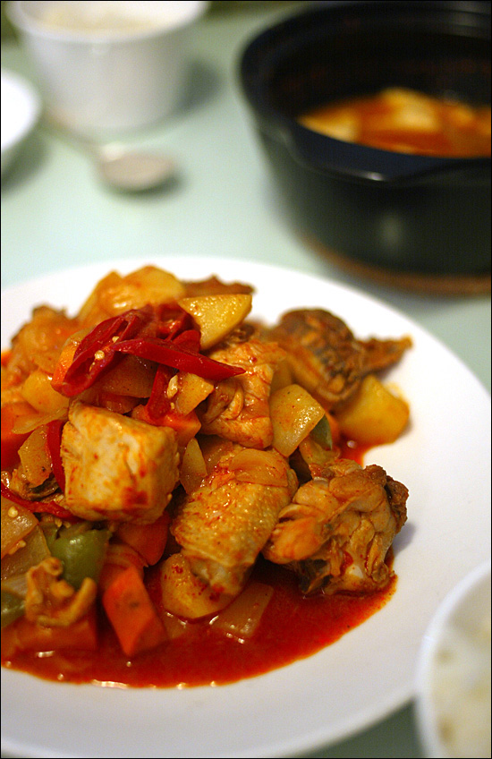

Title: 아내를 위한 요리
Time: 20:24:00

  
  

월요일은 내가 집에 한 시간 반 정도 일찍 들어오는 날이다.

집에 돌아오며 아내를 위해 어떤 요리를 하면 좋을까 생각을 했다.

버스에서 내려 개나리가 활짝 핀 담 밑을 지나 집으로 들어왔다.

허기진 배를 식빵과 오렌지 주스로 달래며 요리책을 보았는데, 닭도리탕이 눈에 들어왔다.

망원 렌즈를 둘러메고 집에서 나와, 아까 눈에 밟히던 개나리와 동네 어귀를 사진에 담고,

집 근처 마트에 들러 홍고추와 피망, 닭, 그리고 야식으로 먹을 딸기를 구입했다.

아내에게 전화했더니 여섯 시에 퇴근한다기에, 좀 더 늦게 들어오라고 채근했다.

처음으로 한 닭 요리치고는 꽤 맵고, 맛이 있어, 둘이서 아주 잘 먹었다.

