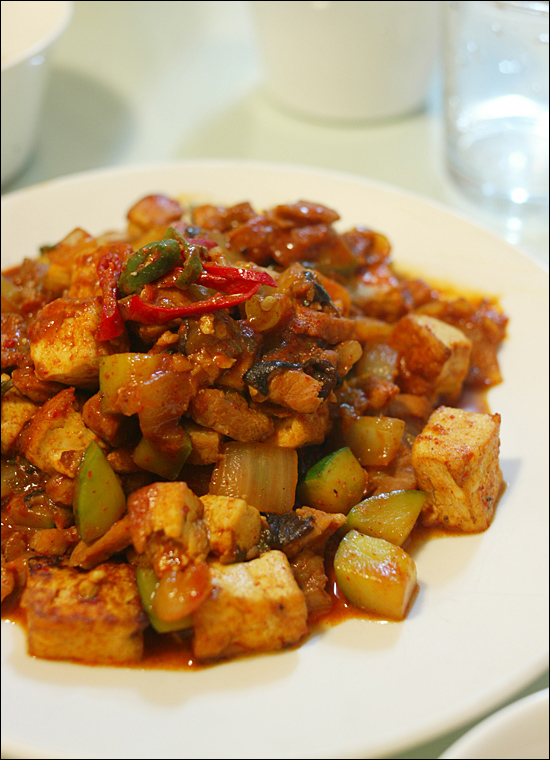

Title: 아내를 위한 요리 - 두부 두루치기
Time: 23:55:00

  
오늘은 서울을 횡단하는 날이었다. 물론 버스로.

아침에 신촌의 학교에 갔다, 오후에는 선릉에 있는 회사에 들러, 저녁에는 강서구의 집으로 돌아오는 코스.

  
  
어제 조금 늦게 들어온 것도 미안하고, 집 청소에 좀 소홀했던 한 주였기에 일찍 돌아와 저녁을 준비하려고 했는데,

어찌나 길이 밀리던지. 아내도 낮에 죽을 먹어 배고픈 상태라 크로켓을 하나 나눠 먹고 밥을 안쳤다.

  
  
두부 두루치기였는데, 점수는 60점.

  
두부 튀길 때 연기를 너무 많이 내서 -15점.

맥주 안주로 먹을 만큼 짭짤해서 -15점.

나머지 감점은 뭐라고 얘기했었는지 기억은 안 나지만 아무튼 -10점.

  
  
60점이라고 자책하고 있어도, 아내는 맛있단다.

  
  
- 장모님과 저녁에 통화했는데, 덜 빨게 보일 때는 고추장 대신 고춧가루를 쓰는 게 좋다 하셨다. 그래야, 짜지 않다고.  
- 두부의 물기를 닦아 튀겨야 한다는데, 어떻게 안 부수고 닦을까?  
  

