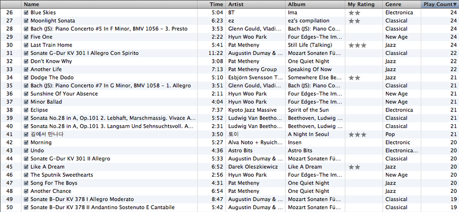
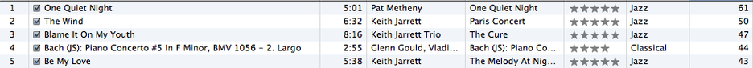
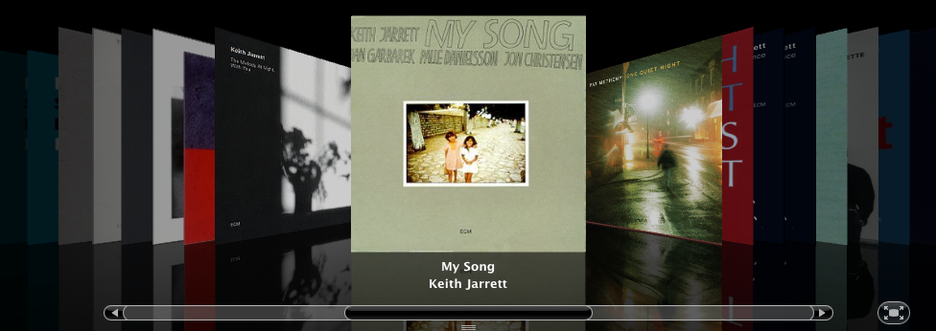

Title: Most often played, 1-5 & 26-50
Time: 02:20:00

아직도 지나치게 협소한 앨범 목록이다. 결혼하고 나서는 앨범 구입량이 좀 줄어든 느낌.

  
Current status : 1667 songs, 6:12:02:18 total times, 11.54 GB

  
Jazz : 538

JPop : 264

Electronic + Techno : 246

New Age : 76

R&B : 49

Latin : 29

Bossa Nova : 26 and so on...

  
  
후배가 iTunes의 Sharing 기능을 통해 들어와서 보더니, JPop과 Jazz를 동시에 듣는 것이 신기하다고 한다.

한 장르만 계속 들으면 좀 나아질런지?

  
  
  
  

  
Top 5에 바흐의 피아노 콘체르토 5번 F 단조 2악장 라르고가 올라선 것이 눈에 띈다.

아침에 들으면 정말 좋다.

  
더불어 Keith로 검색한 앨범들의 Cover flow.

  

  

왜 One Quite Night가 올라왔나 궁금해서 봤더니, 바로 옆 앨범의 My Song이 수록되어 있었다. 들으면서도 몰랐던 부분.

  
  

