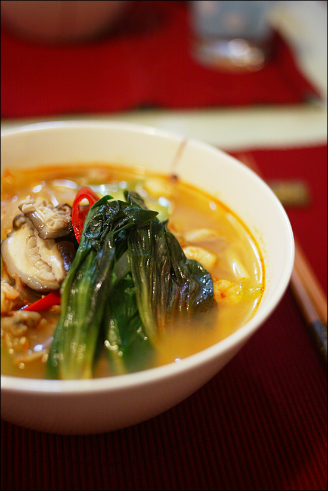

Title: 아내의 요리
Time: 02:15:00

  
아내가 만들어준 복잡한 공정의 요리.

  
초록 채소와 버섯은 미리 데쳐두고, 고추 기름을 내어 새우와 조개를 볶은 것에 육수를 붓고 끓여 국물을 내고,

따로 삶은 면을 넣고 준비해둔 채소와 붉은 고추를 얹어 완성한다.

  
시원하고 맛있었다. 조미료를 넣어 만든 면이나 라면에 비해 어찌나 맑고 개운하던지.

  
  
  

  
  

  

아내가 별식으로 해준 감자전에 맥주를 먹은 오늘.

아내는 어렸을 적, 강원도가 고향이신 부모님을 따라 시골에 가면, 감자전을 먹으려 혼자 쭈그리고 앉아 기다렸다 한다.

  
감자만 넣어 만든 것이 가장 맛있다고 하더니, 정말 맛있었다.

  
내가 한 일은 찍어 먹을 간장을 만든 것과, 맥주를 딴 것. 그리고 실컷 먹은 것.

  

