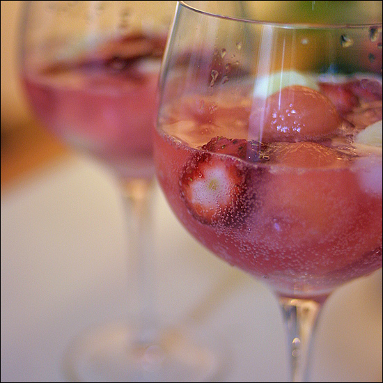

Title: 아내의 요리
Time: 01:02:00

  
요리라고 하기에는 약간 의미가 다른 듯 하지만. 아무튼.

둔촌동 집에서 수박을 얻어 오긴 했는데, 우리는 수박을 잘 안 먹어서 며칠 간 냉장고에 내버려 두었다.

  
그런데 아내가 시원한게 먹고 싶었는지, 남아있던 쥬스, 과일과 숟가락으로 푼 수박을 섞어 화채를 만들었다.

알콜을 조금 넣으면 펀치인가.

  
아주 시원하고 맛있었다.

  
  
교훈 : 사이다는 과감하게 넣자.

