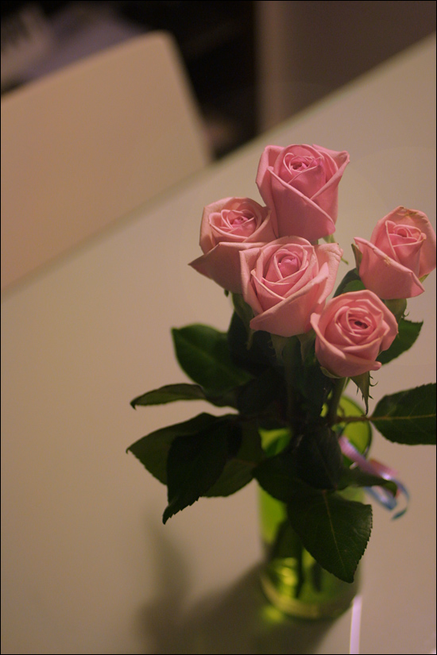

Title: 꽃 선물
Time: 01:12:00

  
결혼 전에도 아내에게 꽃 선물을 종종 하긴 했었는데, 장모님 모르게 사귀던 때라

아내는 집에 털털하게 들고 들어가, 친구에게 그냥 받았다고 말했다 한다.

  
뭐, 특별한 날을 기념해서 준 것도 있지만 그렇지 않은 것도 있으니 틀린 말은 아니다.

  
  
  
결혼 후의 두번째 꽃 선물로, 병원에서 받은 검사 결과가 좋게 나온 것을 기념하는 의미에서 집에 들어오는 길에 샀다.

  
원래 꽃에 요란하게 치장하는 것을 좋아하지 않아,

가시와 줄기만 조금 정리하고 그냥 묶어서 선물하는 편이다.

  
꽃 자체로도 이미 이쁜데, 다른 장식으로 그 아름다움을 깎아내리는 것은 아닌가 하는 고집 때문이다.

  
  
  
아무튼, 의도하지 않았는데 로즈데이(?)인 5월 14일에 선물하게 되었고,

더불어, 형님과 처형께서 마침 집에 오실 일이 있었다.

  
전에 오셨을 때도 내가 처음으로 꽃 사들고 들어왔던 날이라,

처형이 형님에게 좀 보고 배우라고 구박하셨는데, 이번에도 아니나 다를까. 큭큭.

  
  

