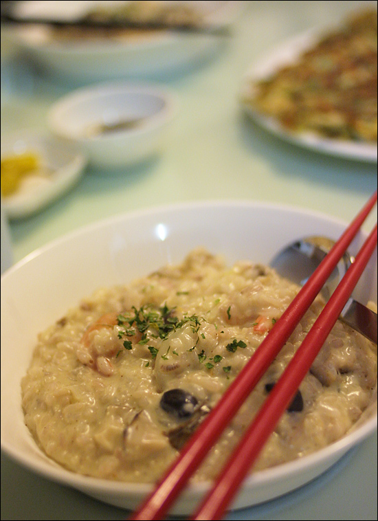

Title: 아내를 위한 요리 - 리조또
Time: 00:57:00

  
  
아내가 먹고 싶은 것이 없다 하여 만든 한국식 리조또.

  
오징어가 없어 새우와 조갯살을 넣고 국물을 내고, 쌀을 윤기나게 볶다 밑 재료를 넣고 국물을 도로 넣어 졸이다가,

우유와 피자 치즈를 넣고 잘 저어 만들었다.

  

집에 남아 있던 재료들로 만들어서 맛을 의심했는데 웬걸, 괜찮았다.

아내에게 맛있다고 칭찬받은 요리.

  
속이 불편하거나 할 때 만들어 먹으면 좋을 듯 하다.

  
  

