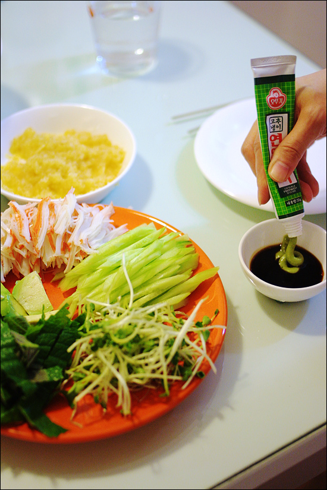

Title: 아내의 요리 - 캘리포니아 롤 (혹은 마끼)
Time: 03:06:00

  
지난 주에 신림동에 들러, 장모님이 키우신 무순을 얻어왔었다.

  
마침 찬밥이 남아있어, 캘리포니아롤을 해먹었다. 는 아니고,

아침부터 캘리포니아롤을 저녁에 먹기 위해, 일부러 흰쌀밥을 지어놓은 아내.

  
아보카도, 맛살, 오이 그리고 중요한 깻잎과 무순을 김에 싸서 마끼처럼 먹으니, 아주 맛이 좋다.

날치알의 비린내를 줄이기 위해, 남아 있던 오렌지 쥬스에 잠깐 씻는 것이 포인트. 라고 아내가 말한다. ^^

  
  
어쩐지 점점 요리 블로거가 되어가는 기분이지만, 맛있게 먹고 나서는 버릇처럼 글을 쓰게 된다.

잘 먹었습니다. 감사합니다.

  

