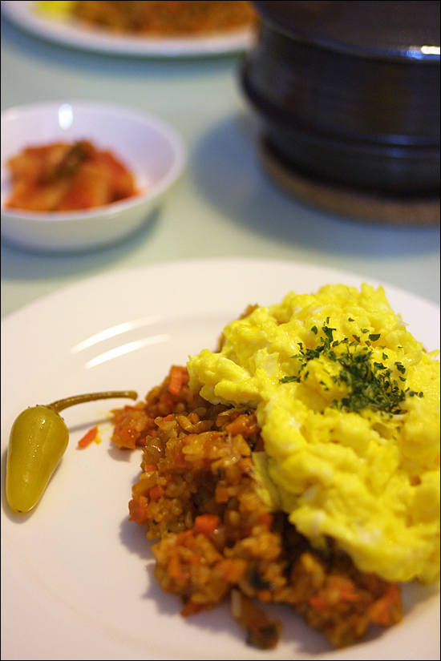

Title: 아내를 위한 요리 - 오므라이스
Time: 00:38:00

  
어느 요리책에서 보았는데, 오므라이스 만들 때에 스테이크 소스를 조금 넣으면 맛있다 해서, 따라 해보았다.

약간 과감하게 넣은 터라 좀 아쉽긴 했는데, 달걀이 조금 맘에 들게 되어 만회.

  
예전에는 달걀 물에 우유를 조금 넣고, 전을 하듯 넓게 펼쳐 부친 다음 밥을 말아 넣곤 했는데,

얼마 전 TV의 요리 프로그램에서 본 대로 스크램블 에그와 유사한 방식을 시도했다.

  
프라이팬을 약간 기울여 달걀 물을 구석으로 몰은 다음, 약간 센 물로 익히면서

젓가락으로 저어가며 한쪽만 굳지 않도록 한다.

  
완전히 익기 전, 점성을 적당히 가진 상태에서 밥 위에 얹는 게 중요하다.

  
  
  
  
  

