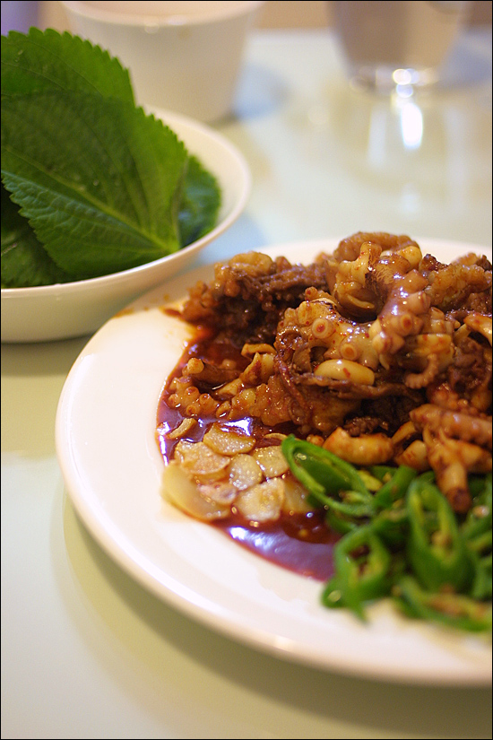

Title: 아내의 요리 - 낙차볶음
Time: 00:47:00

  
결혼 후, 집들이 하면서 아내가 시도했던 요리.

낙지와 차돌박이를 간해두었다가 고추장, 고춧가루를 넣어 볶고, 거기에 볶은 마늘과 고추, 그리고 깻잎을 더불어 내놓으면 완성.

  
양념 물은 따로 물을 붓지 않아도, 낙지에서 솔솔 나오는데, 이것에 밥을 비벼 먹으면 정말 맛있다.

  
집들이 때에는 적게 만들어, 제대로 맛도 못 봤었는데,

이번에 먹어 보니 진짜 감칠맛이 난다. ( 그리고 깻잎이 꼭 필요하다! )

  
  
  
  

