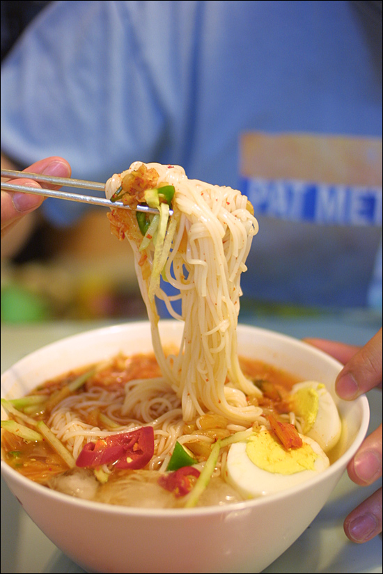

Title: 아내의 요리 - 김치말이 국수
Time: 00:27:00

  
이 국수를 먹고 나서, 아내에게 '요리책 낼까?' 하고 여러 번 물어봤다.

국물에 얼음이 동동 떠 있었으면 더 좋았겠지만, 육수를 다시 끓이느라 그러진 못했다.

  
미리 육수를 많이 끓여, 국을 만들어 먹고 남은 것을 냉장고에 두었다가, 먹기 전에 냉동실에 살짝 얼리면 좋을 듯.

나는 생 오이를 그리 좋아하지 않아 조금만 넣었지만, 오이도 잔뜩 넣는 것이 더 맛있을 것 같다.

  
  

