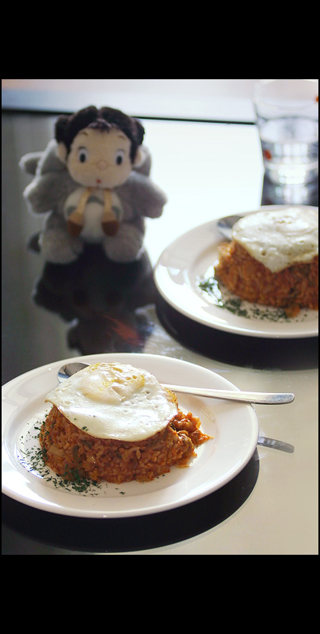

Title: 아내를 위한 요리 - 김치볶음밥
Time: 02:05:00

  

결혼한 후에도 여러 번 해봤지만, 김치볶음밥은 만족스럽게 하기 꽤 어려운 요리라고 생각한다.

  
누구나 쉽게 간단한 재료로 할 수 있지만, 먹는 사람들이 '어떤' 맛을 기대하고 있기 때문에 그 맛을 맞추지 못한다면 맛있지 않고, 잘한다고
해도 그저 기대하던 맛일 뿐이라, 김치볶음밥을 잘 만든다는 소리를 듣기는 어렵다.

  
우선 김치가 맛있어야 하는데, 약간 신 김치가 좋긴 하지만 너무 시어도 적합하지 않고, 젓갈을 많이 넣은 김치는 깔끔한 맛을 내기 어렵게
만드는 요인이 되며, 색다른 맛을 내도록 다른 채소나 햄을 같이 볶거나, 스테이크 소스, 굴 소스 등을 넣게 되면, 김치볶음밥이 아닌 게
되는지라, 그 또한 맛있는 김치볶음밥의 길은 아니다.

  
결국은 전통적인 - 고춧가루를 낮은 온도의 기름에서 볶아, 고추기름을 내고, 거기에 약간 신 김치와 약간의 잘게 썬 양파를 넣어 볶다가,
묵은 밥을 넣고 잘 비비고, 김칫국물을 조금 넣어 졸여 가며, 후추와 소금으로 간을 하고, 마지막에 참기름을 약간 넣어 반지르르하게 만드는
방법을 선택할 수밖에 없게 된다.

  
사진은 그러한 결과물에, 아내를 위한 서비스로 파슬리와 계란을 얹어낸 것.

  
  
  
사람들이 나에게 바라는 '어떤' 것도 이렇게 평가되는 것일까?

