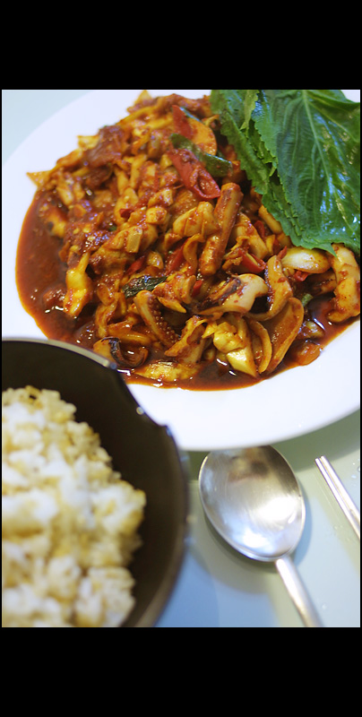

Title: 아내의 요리 - 오징어 불고기
Time: 02:17:00

어제는 어머니 생신이었는데, 시험과 과제와 회사일이 밀려 있다는 핑계로 아내만 둔촌동에 다녀왔다.

혼자 저녁을 먹을 남편을 위해 아내가 미리 준비해 둔 오징어 불고기.

  
쫄깃한 오징어에 매콤한 양념과 향긋한 깻잎이 어우러지니, 어휴. 맛있다.

  
  
아래는 todo list.

  
6/08

<strike>Computer Network, Homework #2</strike>

Operating System, Final Exam 10:00~12:00

Computer System, Final Exam 19:00~21:00

G:PMS - Cross-Works outline

File Structure, Team Project #3

  
6/11

Operating System, Homework #4

<strike>Computer System, Team Project</strike>

  
6/14

Computer Network, Final Exam

  
6/15

<strike>File Structure, Final Exam</strike>

<strike>Compuer Network, Team Project</strike>

  

