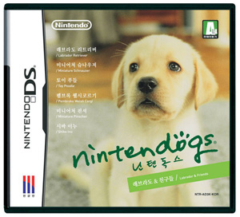

Title: 아내의 감수성
Time: 10:14:00

  
한참 같이 즐겼던 NDSL의 영어 삼매경에 약간 질려, 예전부터 내가 하고 싶어하던 닌텐독스를 사러 갔다.

언제 찾아보았는지 3가지 닌텐독스 중, 골든 리트리버가 있는 타이틀이 맘에 든다고 한다.

( 결국 맘이 바뀌어, 위의 타이틀을 사긴 했지만 )

  
나 : "그럼 그걸로 사자~"

  
아내 : "... 근데, 닌텐독스 강아지도 한참 안하고 그러면 죽는거야?"

  
나 : "설마 죽기야 하겠어? 그리고 내가 죽지 않도록 계속 플레이 할께."

  
아내 : "그래도 죽으면 어떡해... 사지 말자. 응?"

  
나 : "... 직원한테 물어볼까?"

  
  
이 얘길 하는데 눈물까지 글썽거린다.

  
결혼 전에도, 아내는 애완동물 키우는 것을 싫어했다.

그 자체를 싫어하는 것이 아니라, 정을 준 그 애완동물이 세상을 떠나는 순간을 견딜 수가 없기 때문이라고 했다.

  
  
여보, 괜찮아.

닌텐독스 강아지 "현우"는 내가 잘 키울께.

  
근데 왜 강아지한테 내 이름을 붙인게야...... OTL

  
  
  

