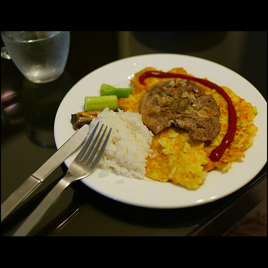

Title: 아내를 위한 요리
Time: 20:47:00

아내가 정말 힘든 몸을 이끌고 하루 하루를 보내고 있다.

날씨도 더운데, 이제 다음 달이면 곧 세상에 나올 우리의 아이를 품고 있느라.

다니고 있는 회사가 집에서 먼 관계로, 요리를 한참 못(안)했었다.

간만에 한 아내를 위한 요리. 제목은 태양의 돼지. ( 영어로 하면 좀 그럴싸 하다.  A pig over the yellow Sun )

냉장고에 들어있던 재료만으로 요리를 하자니, 뾰족한 수가 떠오르지 않아,

우선 냉동실에 있던 돼지 목살을 꺼내 해동 시킨후, 다진 마늘, 후추, 소금과 바질로 밑간을 해두고 곰곰히 생각했다.

균형있는 영양을 위해 당근, 감자, 양파, 계란과 더불어 밀가루와 부침가루를 채쳐서 손으로 조물 조물 하여 베이스를 삼고,

간장에 졸인 느타리 버섯과 소금간만 한 파의 굵은 부분을 곁들여 내놓았다.

아내가 맛있다고 하니, 다행.

( 간을 안 보고 요리하는 편이라 항상 떨리는 마음으로 상을 차린다... -.- )

여보, 힘들겠지만 조금만 더 버티자.

곧 좋은 집에서 귀여운 우리 아기와 함께 지낼 날이 올꺼야. 사랑해.

