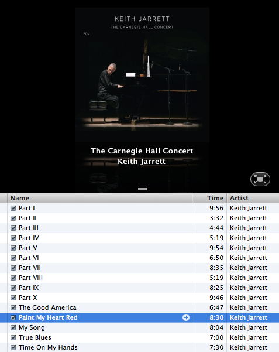

Title: Keith Jarrett - Mon coeur est rouge
Time: 15:44:00

  
1981년 뮌휀 콘서트에서 연주되었던 곡의 2006년의 재연.

같은 때에 녹음되었던 브레겐 콘서트만 CD로 재발매되는 바람에, 힘든 경로로 겨우 들었던 그 곡을

카네기홀 콘서트 녹음반을 통해 다시 들을 수 있게 되었다.

  

어쩐지 너무 깔끔해서 절실함이 좀 부족하게 들리지만, 그래도 좋은 음질로 들을 수 있다는 것으로도 만족.

하지만 뮌휀 콘서트는 꼭 재발매 되었으면 좋겠다.

