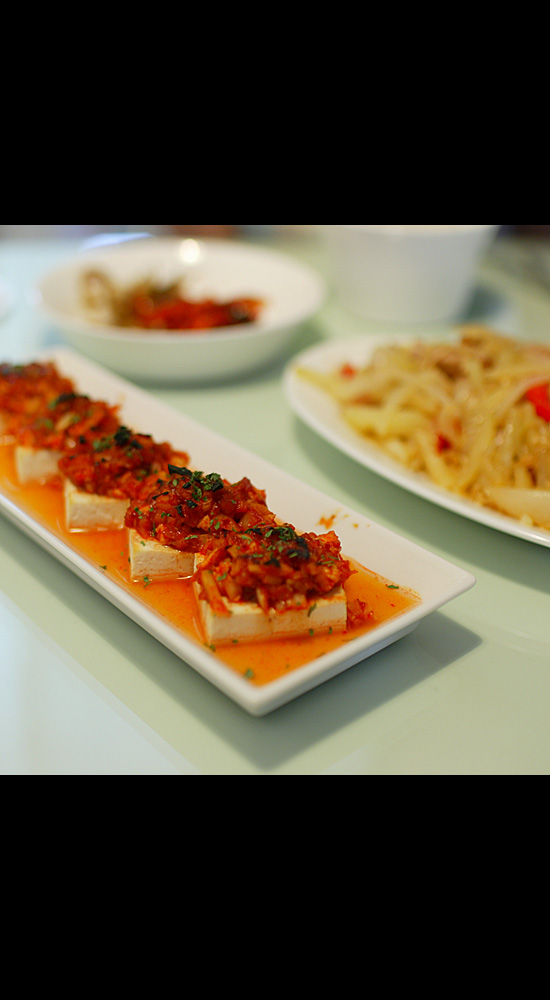

Title: 아내를 위한 요리
Time: 23:46:00

출산을 앞두고, 아내가 많이 힘들어 한다.

그래도 씩씩하게 잘 버티는 걸 보면... 역시 대단하다. 엄마란. 하는 생각이 든다.

남편된 입장에서 해줄꺼라곤 집안일 밖에 없으니 그거라도 잘 해야 하는데,

기본기가 얕으니, 요령 없이 그저 하던대로하는 수 밖엔.

매일 하는 감자-양파-당근-파프리카 위주의 요리가 만들기도 지겹고 (사진 오른쪽에 이미... ), 먹는 사람도 지겨울 것 같아서,

중간을파낸 두부 위에 여러가지 다져 고추장에 버무려 오븐에 넣고 구워봤는데, 좀 타버렸다.

덜 익어서 별 맛도 없는데도 잘 먹어준다. 감사하다.

아프지 말아라, 아프지 말아라.

내일은 오늘보다 더 행복할 꺼야.

