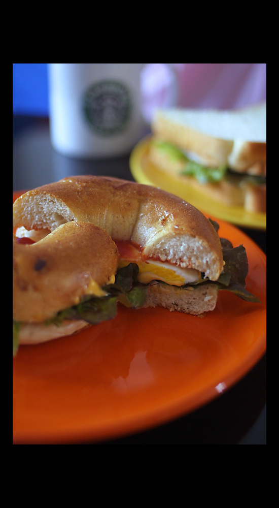

Title: 아내를 위한 요리
Time: 01:11:00

저녁을 대충 해결했더니, 사진이라도 쳐다보고 있게 된다.

표준 방법으로 만들었던 베이글과 식빵을 이용한 샌드위치.

계란을 뒤집지 않고, 약한 불에서 뚜껑을 덮고 오래 익혀, 두툼하면서도 부드럽게 굽는 것이 포인트.

( 훌륭한 스승인 아내 덕분에 이제 잘 굽게 되었다. )

아래서부터, 크림치즈 얇게, 푸른 야채, 계란, (치즈는 옵션) 케챱, 머스타드 소스 순.

