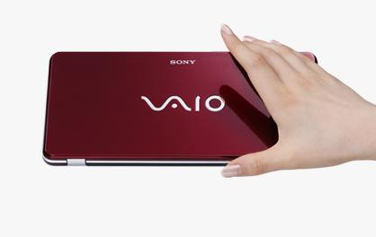

Title: VAIO P - 내가 사게 된다면?
Time: 12:26:00

**1600x 768**

Visual Studio 개발 및 디버깅에 용이하다 -> 나한테 유리.

3:2 해상도의 이미지를 포토샵/GIMP에서 툴바 간섭 없이 편집 가능하다 -> 매력적.

레터박스 없이 영화 감상이 가능하다 -> 노트북으로 영화를 볼 시간이 없으니 무효.

**64GB SSD**

XMB와 더불어 빠른 부팅 및 사용이 가능하다 -> 별 관심 없음.

Access time이 빠르다 -> 컴파일러와 링커 돌릴 때 좀 빠를지도.

기존 HDD에 비해 용량이 다소 모자르다 -> 64GB면 나한테는 충분. ( 개발툴, 오피스, Adobe 계열 )

**Windows Vista**

1.6Ghz여도 SSD덕에 잘 돌아갈 듯.

하지만 Mac OS X 설치가 안되면 문제. iWork이랑 iLife 쪽은 어떻게든 대체가 되는데, iPhone개발하기가 힘들 듯.
현재까지는 iPhone/iPod Touch jailbreak하고 디버깅 없이 하는 수 밖엔 없음.

**배터리 지속 시간**

기본형 4.5시간이라는데, 실 사용은 3:20정도일 듯 -> 외부에서 사용할 일이 별로 없으니 OK.

**무게**

SSD 모델이 594g, HDD 모델이 620g -> 모바일로 쓰려는 용도가 아니라, 회사와 집에서 동일한 상태로 일하고 싶은 나에게는
최적. 이동하면서 쓰고 싶은게 아니라 데이터와 애플리케이션을 들고 다니고 싶은 목적.

**포인팅 스틱 채용및 팜레스트 없음**

Apple MBP에서 처음으로 터치패드를 본격적으로 써봤는데 ( 그 전엔 IBM 빨콩 매니아 ), 포인팅 스틱과 비교시 나름괜찮음. 적어도
집게 손가락이 아프지는 않으니 ^^; 아무리 키보드부가 얇아도 팜레스트가 없으면불편한데, HP TC1100의 키보드에도 적응했으니 문제 없을
듯.

결론: 사고 싶은데 돈이 없고, 결정적으로 Mac OS X 설치 여부가 문제.

