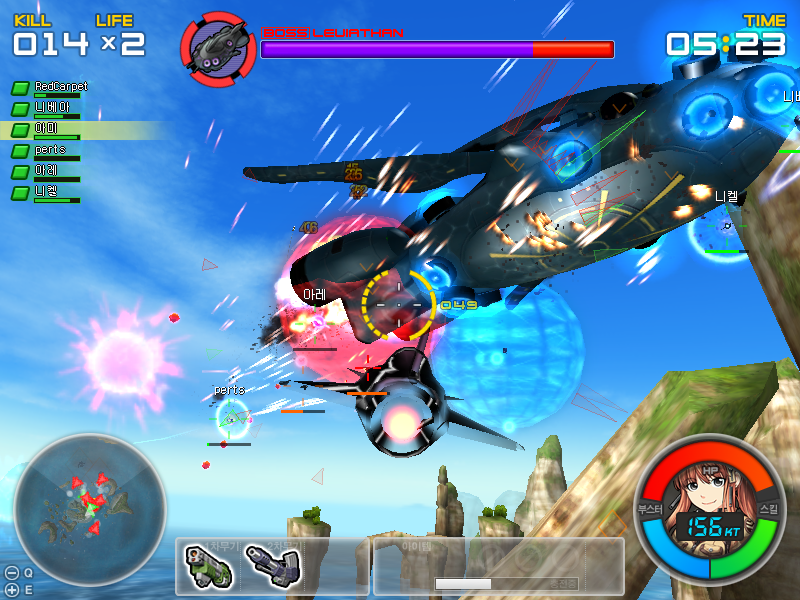
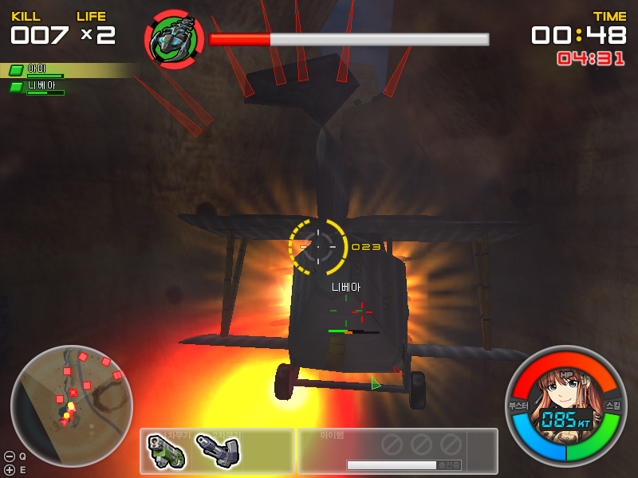

Title: G2 CBT 후기
Time: 18:15:00

G2 CBT 4일째... 비행기도 미라지로 바꾸고, 기간툴라, 리바이어선까지 다 잡았다.

두려움(?)을 떨쳐내고 2:2 대전모드를 했는데, 우연히 승리!

생각보다 대전모드 하는 사람이 너무 적던데, 텐션 유지가 관건이 아니었나 싶다.

[대기 > 게임중 > 대기] 사이클에서 기본적으로 게임 플레이 타임이 긴 경우엔 텐션을 높였다 낮췄다 잘 해줘야 하는데, 죽고 나서 10초
대기후 재시작으로는 잘 낮아지지 않는 듯. 현재 제공되고 있는 맵들에서는 더욱 그러하다. ( 나오자마자 상대방이 내 꼬리에서 사격...--
)

옛날 골드윙에서는 등장하면 몇 초간 무적 상태라서, 나오자 마자 죽는 일은 없었는데,

G2는 나오자마자 상대방은 날 쏘는데, 나는 화면이 고정되서 조정이 안되는 상태로 1초 정도 기다려야 한다. 개선되면 좋을 부분. ->
확인해보니, 무적 상태가 있긴 한데 화면상으로 확인할 수 없어서 억울함을 느끼게 된다. 깜빡거리던지 쉴드가 있던지 하는게 좋을 듯.

어떤 게임이든 그렇지만, GP나 경험치 분배도 좀더 여유 있게 주었으면 하는 아쉬움이 남는다.

물론 컨텐츠 소모 속도도 문제지만, 겜블링(강화)가 있는 이상 강화쪽으로 GP를 쉽게 소모할 수 있었을 텐데, 현재는 너무 짜다는 느낌. 위
스크린샷은 부족한 GP를 채우기 위해 [니베아]님과 앵벌이 하고 있는 모습 --;

