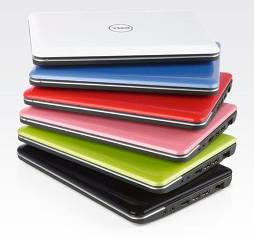
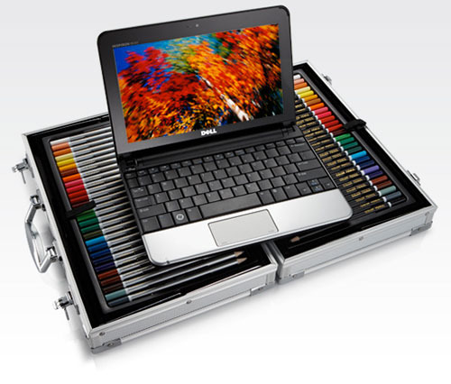

Title: Dell Mini 10 - 2월 26일 발매(예정)
Time: 18:53:00

드디어 나오는 Dell Mini 10.

사양은 예정된 그대로인 듯 하고, 같은 10인치라도 1366x768과 1024x576 중에 고를 수 있는듯. 특히 베젤부터 HP 넷북
시리즈와 같이 틈새 없이 이어지는 구조라 더 깔끔해 보인다. 그 외에도 전작인 Mini 9에서 부족했던 부분을다른 넷북들과의 벤치마킹을 통해
많이 개선한 것으로 보인다.

가격은 대충 $599에서 시작될 듯. 기본 옵션은 1024x576에 160GB 하드가 아닐까?

내 용도에는 32GB SSD에 1366x768, 램 2GB면 딱 좋을텐데.

... 뭐 아무리 말해도 살 리는 없겠지만 -_-

