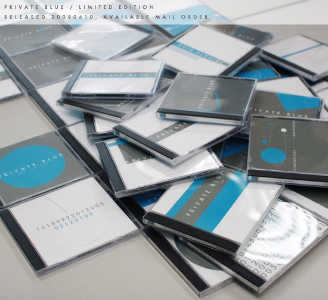

Title: Private Blue 발매
Time: 10:31:00

제 두번째 피아노 앨범인 Private Blue를 2009년 6월 10일 발매하였습니다.

[http://studio.amiryo.com](http://studio.amiryo.com/)

실험적이었던 1집 Four Edges와 비교하면, 비교적 대중적인 곡들을 골라 녹음하였습니다.

추가로, 1999년에 만든 자작곡과 친구인 N2, Jung Sang이 리믹스한 2곡이 실려 있습니다.

이 시대에 음악이 미디어로 판매되는 일이 그리 녹녹한 일이 아님을 알지만, Back to the Basic의 정신으로,음원 자체는 홈페이지를
통해 mp3로 다운받을 수 있도록 하고, 앨범의 소유 그자체에 가치를 부여하고자했습니다.

그래서, 이번 앨범은 50장 한정으로, 50장의 앨범 각각이 모두 다른 디자인을 갖도록 제작하였습니다.

앨범 자켓은 물론, CD표면에도 시리얼을 기입하기 위해서, 인쇄소나 프레싱 업체에 맡겨 제작할수도 없어,직접 한 장 한 장프린팅하고 CD
표면 인쇄와 레코딩도직접 하였습니다.

어쩌면Beck의 <The Information> 앨범이 추구하고 있는 가치와도유사하다고 할 수 있겠습니다.

[http://www.designflux.co.kr/first_sub.html?code=530&board_value=dailynews](ht
tp://www.designflux.co.kr/first_sub.html?code=530&board_value=dailynews)

자켓 내에도 같은 말을 적었지만, 대단한 무언가를전하기 위해서 만든 앨범은 아닙니다.

그저 나누고 싶은, 그런 마음이 있을 따름입니다.

이 앨범을 완성하기까지 옆에서 물심양면으로 도와준 아내에게 이 고마움을 전합니다.

감사합니다. 사랑합니다.

2009. 6. 11

