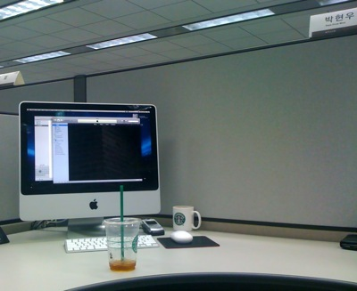

Title: todo list + workspace
Time: 00:58:00

  

우여곡절 끝에, 사파리에서 사진을 본문 첨부하는데 성공.아무튼 된다.

자리 옮기면서 다시 한 번 청소.

  

  

  * flaxis 오픈소스화 ( [http://flaxis.googlecode.com](http://flaxis.googlecode.com/))
  * flaxis java 포팅, 더불어 eclipse + PDT
  * minidom, npk의 wiki page 및 예제, 도움말 제작
  * wxwidget 스터디 및 npk gui 툴 제작
  * SpringCat linux/mac build branching
  * MorningEditor의 동영상 첨부 기능 개선
  * DualEditor에 대한 아이디어 회의 및 프로토타이핑
  * 안정화 지표 회의
  * nerf 골격 잡기
  * seven 구체화
  * <strike>morning 버그 수정</strike>
  * CodeIgnitor 지켜보기
  * <strike>"Height" 시작</strike>

  

  

  

  

