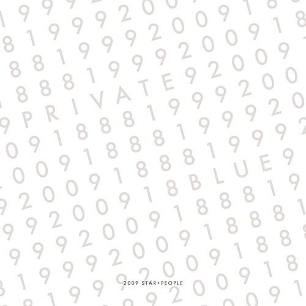

Title: About Private Blue
Time: 05:52:00

  

언젠가 이런 글을 써야지 하는 생각이 있었는데,

지금 쓰지 않으면 앞으로도 쓰지 못할 것 같은 마음에 적어본다.

  

1. Blue Room (theme)

처음 독립해서 나와 살던 반 지하방에서 만든 곡.

혼자 있던 밤 시간에 주로 Kurzweil PC88로피아노 곡을 녹음했었다.

방 한가운데에 건반이 있었고, 건반은 현관과 부엌을 바라보는 형태로 배치되어 있었는데, 새벽 시간, 휑한 그 공간을 바라보며 녹음했던 기억이
있다. 좀 더 길게 만들고 싶었지만, 그러지 못해 그대로 방치되다 상욱이의 리믹스에 힘입어 이번 앨범의 타이틀로 선택되었다.

  

2. 지구에서 보낸 편지

나에게 김광민이라는 피아니스트를 알게 해준 곡.

고등학교 때 하이텔 소모임을 통해 김광민을 알게 되었고, 그의 연주도 처음 듣게 되었다.

지금도 이 곡을 들으면 그 때가 생각난다.

원곡의 제목은 지구에서 온 편지지만, 나는 조금 다르게 해석해 지구에서 보낸 편지라는 제목을 붙였다.

아무래도 원곡이 그랬던 것처럼, 나도 죽음을 생각하며 연주해보았다.

  

3. 익숙한 그집앞

토이의 수작 '익숙한 그집앞'의 타이틀 곡을 유사하게 연주하고자 노력했다.

원곡보다 더 느리고 따뜻한 분위기를 내고 싶었는데, 역시 원곡만한 편곡은 없는 것 같다.

내결혼식에서 이 곡을 친구인 상원이가 연주해주고, 아내와 나는 편지를 읽었었다.

어떤 생각에서 이 곡을 골랐는지 기억나지는 않지만, 곡을 듣고 있자면지금도 그 때의 감정이 느껴지는 것 같다. 뭔가 벅찬...

  

4. 보내지 못한 편지

역시 원곡에 비하면 한 없이 부족한 연주이지만, 그래도 나만의 색을 내보고자 노력한 트랙.

그나마, 앨범에 실린 곡들 중가장 대중적인(?) 연주 스타일에 속하지 않을까 생각된다.

  

5. Provision of the nature (remixed)

이전 앨범(four edges)에 실린 곡 중 하나를, 상원이에게 리믹스를 부탁했다.

꽤 구체적인 스타일을 제시하며 부탁했는데, 원했던 것 이상으로 너무 좋은 곡을 만들어주었다.

언젠가 이런 음악으로 가득찬 앨범을 만들어보고 싶다.

  

6. Gymnopedie No.1

A면(1-5번)의 피아노곡이 한국 음악가들(김광민,토이)의 곡이라면, 6번 트랙부터는 B면으로 외국곡들을 녹음해보았다. 고등학교 시절
상욱이가 잠뱅이라는 브랜드의 CF 배경음악이라면서 이 곡과 함께카피곡을들려주었던 기억이 난다. 류이치 사카모토의 짐노페디에 비해 더 느리고
풍부한 음을 살려보고자 했다.

  

7. Lost Child

회사에서 친하게 알고지내던 분의 어린아이가, 어느날 갑자기 이 세상을 떠났다.

나는 충격에 아무 말도 할 수 없었고, 그 분을 위로하거나 도와줄 수 있는 방법이 전혀 없음에 좌절감을 느꼈다.

당시 37건반의 피아노를 연주하기에는 적합하지 않은 미디 키보드밖에 없었지만, 어떻게 해서라도 이 곡을 녹음하지 않으면 안될 것 같은
마음으로, 4파트로 쪼개어 4번에 걸쳐 녹음한 것을 합성하여 곡을 완성하였다.

지금도 이 곡을 들으면 그 아이의 생각이 난다. 안녕. 그 곳에서편안히 잘 있기를.

  

8. The moonlight sonata

나에게는 너무 멀고도 먼 클래식곡을 연주하였다. 다른 피아니스트들의 월광 연주가 너무 빠른 것이 아쉬워 나는 느리게 녹음해보았다. 어차피
2악장은 실력이 안되 녹음할 수 없으므로, 1악장 만이라도 제대로 녹음해보자는 마음으로 연주하였다. 적어도 100회 이상 반복해서 연주했었던
기억이 난다.

  

9. Blue room (rawmix, inst.)

테마곡인 Blue room을 친구인 상욱이가 리믹스 해준 곡.

원래는 좀더 길고 보컬이 들어간 버전으로 제작될 예정이었지만, 앨범의 성격과 일정상 생략되었다.

Provision of the nature의 리믹스와 마찬가지로, 나도 만들어보고 싶은 스타일의 곡.

언젠가 친구가 앨범을 내서, 이번에 적었던가사와 함께 들을 수 있는 날이 오기를 바란다.

  

10. 8150-68 (original)

고등학교 시절, 친구들과 함께 모듈 음악의 세계에 흠뻑 빠져 살았었다.

이정환, 정상욱, 조해성과 함께 4y4d라는 그룹(?)을 결성하여 앨범도 만들었었는데, 그 당시에 만들었던 곡 중 하나.

당시에는 좋은 음원을 구할 수 있는 길이 거의 없어, 외국 유명 음악가의 음악을 다운받아, 그 안에 들어 있는 음원을 재사용하는 것이 유일한
획득 경로였다. 이렇게 얻은 양질의 음원을 듣고 있으면 새로운 악상이 떠올라 새 곡을 쓰거나, 혹은 그런 음악을 카피하곤 했는데, 이 곡도
마찬가지.

거기에 즉흥적으로 수화기에 대고 녹음한 삐삐의 ARS음성이 썩 괜찮게 어울린 것 같다.

지금 들어도 그리 낡은 음악이 아니라, 마지막 보너스 트랙 형식으로 이번 앨범에 넣게 되었다.

  

언젠가 기회가 된다면 50개의 디자인에 대해서도 이야기해보고 싶다.

나에게는 모두 사연이 있는 50개의 디자인이니까...

  

  

적고 나니 너무 짧게 느껴지는 지난 10년이다.

앞으로의 10년은 또 어떨까.

  

  

