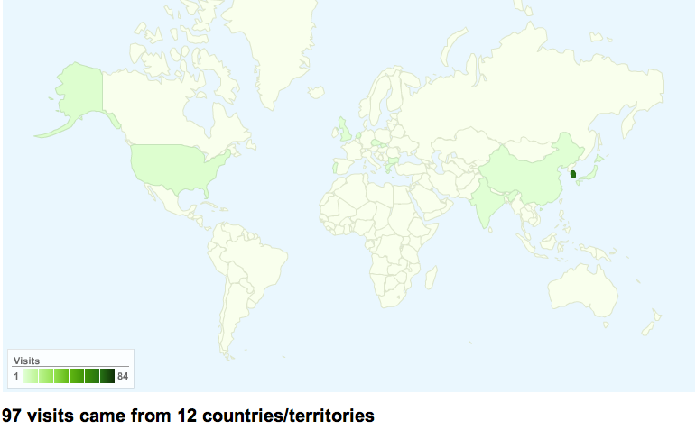

Title: google analytics
Time: 23:19:00

  

google analytics + google code

구글 코드에는 google analytics를 손쉽게 적용할 수 있는 기능이 포함되어 있다.

얼마 전 공개했던 minidom (http://minidom.googlecode.com)에 대한 google analytics 분석 결과
중, 국가별 분포도.

  

참 잘만들었다는 생각이 든다. nerf에서도 유사한 기능을 꼭 넣어보고 싶네.

  

일반 웹 사이트에도 제공되는 3-4줄의 자바스크립트 코드를 넣으면 적용할 수 있다.

불필요한 로그 트래픽을 유발할 필요도 없고 좋은 것 같다. 단, 광고 없는 - 즉, 무료 - 방식으로 5백만 PV까지 가능한 듯.

  

