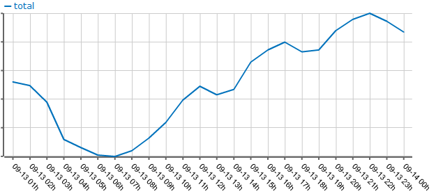

Title: 사람은 밥을 먹는다.
Time: 00:50:00

본의 아니게, 회사에서 또 하나의 통계 툴을 일주일째 만들고 있다.

개인적인 취향을 만족시키기위해, open flash chart([http://teethgrinder.co.uk/open-flash-
chart/](http://teethgrinder.co.uk/open-flash-chart/))를 통해 차트를 그려보았다.

일단 사용하기에 불편한 것은 아닌데, 레퍼런스가 doxygen밖에 없고, 튜토리얼이 다소 난잡하여, 모든 기능을 다 파헤쳐서 쓰려면 좀
들여다 봐야 하는 단점이 있다. 더 잘 만들수 있었을 것 같은데, 약간 아쉬운 차트 라이브러리. 아무튼, 서너시간 들여서 통계 쪽 전체에
차트 붙이기 성공. 아래와 같은 모습이 된다.

각각에 대한내용은 삭제하고 그래프만 캡춰.

아래는, 동시 접속자 합계 그래프.

나의 분석 : 사람은 주로 12시~2시 사이에 점심을 먹고, 5시~7시 사이에 저녁을 먹지만, 아침은 대충 먹는다. 이게 무슨 분석이야...

결론 : 사람은 밥을 먹고 산다.

