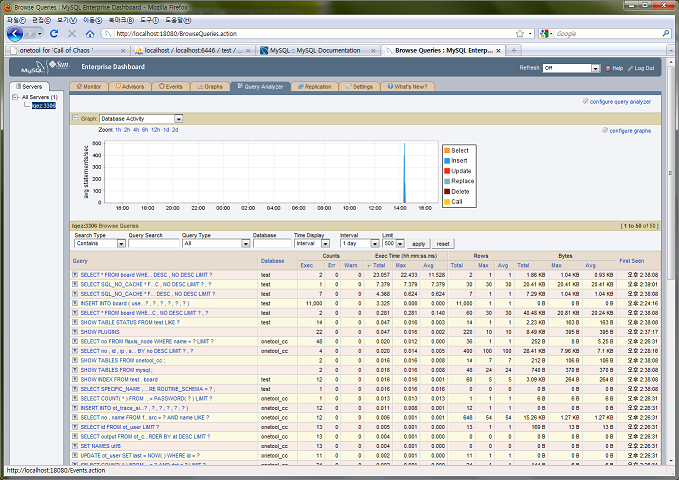

Title: MySQL Monitor / Query analyzer
Time: 16:03:00

MySQL이 Sun에 인수된 이후로 Enterprise급에포함되어 배포되는MySQL Monitor를 한번쯤 사용해보려고 했는데, 오늘 문득
생각이 나서 설치해보았다. ( Windows 7 사용중인데, 별 문제 없이 잘 설치된다. )

계정 등록부터 설치 과정 완료까지 별로 어렵지 않고, 정리하면 다음과 같다.

  * MySQL 계정을 등록한다. 별다른 절차 없이 바로 가입 가능.
    * Trial Subscription은 MySQL 계정 없이도 가능하다. 굳이 필요하지는 않음.
  * MySQL Enterprise Trial Subscription 계정이 필요하므로, [http://www.mysql.com/products/enterprise/query.html](http://www.mysql.com/products/enterprise/query.html)에서 Try It Now 링크를 통해 사용 신청을 한다.
  * 사용 신청을 하면 메일로 접속 주소와 비밀번호를 보내준다.
  * [https://enterprise.mysql.com](https://enterprise.mysql.com/)에서 지급받은 비밀번호로 로그인.
  * Download 탭에서 Service Manager and Dashboard(이하 Monitor)의 Full Installer 그리고 Agents의 Full Installer에서 자신의 플랫폼에 맞는 파일을 각각 받는다.
  * Monitor를 먼저 설치하고, Agent를 설치한다.
    * Monitor를 설치하면 Monitor를 위한 별도의 Tomcat http server와 MySQL이 설치된다. 기존에 있는 MySQL Instance를 쓰려면 다른 방법이 필요할 듯.( Tomcat은 18080, MySQL은 13306을 기본으로 사용한다 )
    * Agent를 설치하면서, 기존에 사용하고 있던 MySQL Instance의 정보를 입력하여, 모니터 할 수 있도록 한다. ( Agent는 기본으로 6446 포트 사용 )
    * 오프라인 환경에서는 Advisor Bundles & Product Key를 미리 받아 activation 해야 한다. 인터넷이 연결되어 있을 때는 위에서 발급받은 Trial Subscription 계정을 입력하여 보다 편리하게 activation할 수 있다.
  * Monitor 의 tomcat페이지에 접속해, 모니터와 서버 instance의 등록 상태를 확인한다.
  * Agent를 설치할 때 지정한 Proxy port를 기억해두고, 기존에 MySQL에 직접 접속하던 애플리케이션들을 Agent의 Proxy port로 연결되도록 수정한다. (예: localhost:3306 에서 localhost:6446 등으로 변경 )
  * 실제로 쿼리를 수행해보고 접속하여 Query analyzer등을 통해 결과를 확인한다.

주의할 점은, Agent가 설치될 컴퓨터의 hostname이 영문/숫자로만 이루어져 있지 않을 경우에 Agent 실행이 실패할 수 있으므로
미리 hostname을 변경해둬야 한다. 회사의 개발 컴퓨터는 실명을 컴퓨터 이름으로 하도록 되어 있어서, Agent service가
실행되지 않는 문제점이 있었다. ( 예: 2010-01-27 14:04:48: (critical) the agent.server-name
setting (박현우) only allows characters of [ -a-zA-Z0-9()._], but contains '?)

이 외에도 Agent가 정상적으로 실행되지 않는다면 설치된 폴더의 mysql-monitor-agent.log를 통해 문제를 확인할 수 있다.

아래는 실행화면 캡춰. 실 서비스에 붙여봐야 그 진가를 확인할 수 있을 것 같다.

