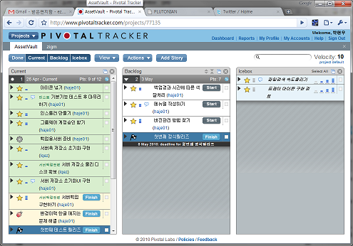

Title: Pivotal Tracker 도움말/FAQ를 번역해보았다
Time: 14:50:00

[http://www.pivotaltracker.com/help](http://www.pivotaltracker.com/help)

위 문서중 일부를 번역해보았다.

  

*** Overview**

**Pivotal Tracker란 무엇인가?**

Pivotal Tracker(이하 트래커)는 Pivotal Labs에 의해 개발된 스토리 기반의 프로젝트 계획 툴이며, 이를 통해 팀은
작업(리얼월드)의 변화를 수집하여, 즉각 반응할 수 있게 된다. 이는 기본적으로 애자일 소프트웨어 개발 방법론에 근거한 것이나, 이를 더욱
넓은 범위의 프로젝트에 적용할 수 있도록 했다.

  

역주: 애자일에 익숙하지 않은 사람(역자 포함...)들을 위해 트래커에서 사용되는 어휘를 정리해보았다.

  * 스토리 / Story
    * 어떤 일/업무의 최소 단위.
  * 포인트 / Point
    * 스토리를 처리하는데 필요한 일의 단위를 포인트로 부여함.
  * 벨로서티 / Velocity
    * 일정 주기에 팀이 처리할 수 있는 포인트의 합 - 또는 그 평균을 의미함.
  * 주기 / Iteration
    * 벨로서티 측정을 위한 단위. 기본 값은 1주.
  * 아이스박스 / Icebox
    * 분류되거나 평가되지 않은 스토리가 들어 있는 장소. 새로운 스토리를 생성하면 이곳에 모인다.
  * 현재 패널 / Current panel
    * 현재 주기(Current Iteration)에서 처리할 수 있는 스토리들이 표시되는 곳.
  * 백로그 / Backlog
    * 앞으로 처리해야 할 스토리들의 목록. 측정된 벨로서티에 따라 주 단위로 구분되어 표시된다.
  * 완료 패널 / Done panel
    * 완료된 주기에 속한 스토리들이 모이는 장소.

  

  

*** Projects**

**프로젝트란 무엇인가?**

가치를 가져다 줄 수 있는 - 더 작고 명확한 조각으로 나뉠 수 있는 - 것이라면 무엇이든 프로젝트가 될 수 있다. 전자상거래 웹 사이트
제작이나, 다리 건설, 광고 캠페인을 만드는 일 등을 프로젝트로 볼 수 있다.

  

  

*** Stories**

**스토리란 무엇인가?**

스토리는 프로젝트에 대한 작고 명확한 상품(가치)이다. 소프트웨어 프로젝트에서는 소프트웨어 사용자 관점에서의 어떤 기능에 대한 간결한 설명이
될 수 있다. 팀 구성원 - 개발자, 임원들, 심지어 사용자까지 - 의 모두가 이해할 수 있어야 좋은 스토리다. 예를 들면 다음과 같다.
'사용자는 자신의 쇼핑 카트에 물건을 담을 수 있어야 한다'

  

**스토리를 작은 태스크(일)로 쪼갤 수 있는가?**

프로젝트를 되도록이면 하나의 기능 단위로 작게 쪼개는 것을 추천한다. 하지만 작은 스토리라도 가끔은 태스크(일)로 쪼개 관리하기를 원하는
개발자가 있을 수 있다. 실험적이긴 하지만, 프로젝트 설정에서 스토리 태스크(story tasks)기능을 활성화 할 수 있다. 스토리 내에서
태스크를 생성/삭제하고 완료 여부를 체크할 수 있지만, 이것이 스토리의 상태를 바꾸지는 않는다.

  

**왜 스토리가 백로그로부터 현재 패널(current panel)로 옮겨지는가?**

트래커는 프로젝트 벨로서티(Velocity)에 맞춰 자동으로 백로그의 상위 스토리들을 현재 패널로 옮겨 놓는다. 예를 들어, 벨로서티가
6이라면, 트래커는 6 포인트에 해당하는 스토리를 수행되어야 하는 것으로 간주하여 현재 주기(Current Iteration)로 옮기게
된다. 단순히 백로그의 위에 현재 패널이 있다고 생각하면 편하다. 또한, 뷰 메뉴에서 그렇게 보이도록 하는 옵션(Include Current
in Backlog)도 있다.

  

**완료된 스토리가 언제 완료 패널(Done)으로 옮겨지는가?**

현재 주기가 끝날 때까지, 완료된 스토리(Accepted stories)는 현재 패널에 남아있으며, 새로운 주기가 시작되면 완료된 스토리는
자동으로 완료 패널로 옮겨진다. 주기는 설정하기 나름인데, 보통은 주 단위를 사용한다.

  

**왜 완료된 스토리를 완료 패널로 직접 옮길 수 없는가?**

(역주:위의 내용과 겹쳐 미진한 부분을 따로 적습니다.)

어차피 한 주기가 끝나면 자동으로 완료 패널로 옮겨지게 되고, 이를 바탕으로 벨로서티를 측정하게 되므로, 수동으로 옮기는 것이 제한되어
있다. 주 단위의 주기를 사용할 경우, 한 주는 월요일에 시작되는데, 월요일 아침에 새 주기로 기존 주기를 대체하게 된다. 이는 설정에서
변경할 수 있다.

  

**하나의 스토리를 동시에 편집하면 어떻게 되는가?**

트래커를 보여주고 있는 웹 브라우저는 서버와 수 초마다 동기화되고 있다. 만약 두 명 이상이 동시에 같은 내용을 편집했다면, 트래커는 하나를
골라 저장한 후, 다른 사람이 편집한 내용은 롤백한다. 그리고 이것을 사용자에게 알려주게 되어 있다. (역주:먼저 편집을 시작한 쪽의 내용이
저장되고, 나머지 사람에게 이를 알려주게 되어 있다.)

  

**특정한 스토리를 어떻게 찾을 수 있는가?**

프로젝트 페이지의 상단에 있는 검색을 사용하면 된다. 단순하게는 스토리의 이름이나 설명(description)을 입력해서 검색할 수도
있으나, 그 외에 요청자, 할당자, 그리고 첨부 파일이나 첨부 파일에 대한 설명에 대해서도 검색할 수 있다. Reveal 버튼을 이용해 해당
스토리를 강조할 수 도 있다.

( 역주 :[http://www.pivotaltracker.com/help#howcanasearchberefined](http://www.p
ivotaltracker.com/help#howcanasearchberefined)링크를 통해 상세 검색에 대한 안내를 확인할 수 있다. )

  

**하나의 스토리가 여러 프로젝트에 연관될 수 있는가?**

안된다.

  

  

*** Velocity**

**벨로서티란 무엇인가?**

벨로서티는 한 주기 동안 얼마 만큼의 포인트를 처리할 수 있는 가에 대한 값이다. 이는 최근에 완료된 주기들의 평균으로 측정될 수 있다.
이를 통해 트래커는 과거의 퍼포먼스에 비추어 마일스톤들을 언제 완료할 수 있을지 예상해볼 수 있다.

  

**포인트는 무엇인가?**

포인트는 하나의 기능 스토리(Feature story)를 수행하는데 필요한 공을 의미하는 상대적인, 팀에 특화된 단위이다. 이는 작업일과
같은 구체적인 값이라기 보다는 상대적이며, 직관적인 단위라 할 수 있다.

  

**벨로서티는 어떻게 계산되는가?**

주기가 끝날 때마다, 현재 주기에 속한 완료된 스토리들은 완료 패널(Done panel)로 옮겨가게 된다. 이 때 옮겨지는 스토리들의 포인트
합이 완료된 주기에 기록되며, 지난 N회의(1~4회로 설정 가능) 주기의 포인트 합에 대한 평균을 팀 벨로서티라 한다. 남아있는 스토리들은
이 벨로서티를 기준으로하여 미래의 주기들로 그루핑 된다. 트래커가 주기를 정확하게 벨로서티에 맞추지 못할 때는, 평균 벨로서티를 유지할 수
있도록 연속된 주기내에서 평균적으로 포인트를 분배한다. 예를 들어 벨로서티가 10이고, 다음 주기의 포인트합이 8인데, 다음 번 우선순위의
스토리의 포인트가 3이라면, 다음 주기의 포인트는 8로 놔두고, 그 다음 주기의 포인트를 12로 맞추도록 한다.

시간에 따른 벨로서티 값의 변화는 차트 패널(Charts panel)의 벨로서티 차트에서 확인할 수 있다. 이 차트는 각 주기의 실제
벨로서티와 벨로서티 평균, 프로젝트 전체에 대한 벨로서티 값, 그리고 벨로서티의 표준 편차를 보여준다.

  

**벨로서티 초기화란 무엇인가?**

프로젝트가 생성되면, 벨로서티를 측정하기 위한 이력이 없기 때문에, 첫번째 주기가 끝날 때 까지는 기본 벨로서티(Initial
velocity)를 사용하게 된다. 벨로서티를 측정하기 위한 충분한 데이터가 수집되면, 이 초기 벨로서티는 더 이상 사용되지 않는다.

다만, 프로젝트가 한동안 활성화되지 않아 벨로서티가 0이 되면, 의미있는 벨로서티가 측정될 때까지 기본 벨로서티를 사용하게 된다.

  

**프로젝트의 벨로서티를 어떻게 바꿀 수 있는가?**

벨로서티를 직접 바꿀 수는 없다. 트래커가 지난 주기들을 분석해 계산해낼 뿐이다. 벨로서티는 팀이 한 주기동안 얼마만큼을 해냈는가를 반영하는
값이 된다. 사용자가 스토리들을 추정(포인트부여)하고 우선순위를 부여하기만 하면, 트래커가 공과 시간을 공정하게 측정하여 알아서 계산하게
된다.

  

**이번 주기에 더 많은 (혹은 적은) 스토리를 넣어도 되는가?**

트래커가 알아서 하게끔 놔두는 것을 추천하지만, 벨로서티가 올바르게 측정되기 어려운 프로젝트 초기에는 트래커가 예상한 것보다 더 많은
(적은) 스토리를 넣어도 된다. 수동으로 해보기로 마음 먹었으면, 프로젝트 셋팅 페이지에서 'Commit Mode'를 켜고, 스토리를
수동으로 옮기면 된다. 단, 현재 주기(Current Iteration)에서만 가능하고, 백로그의 주기들은 여전히 벨로서티에 의해 자동으로
평가됨을 주의하라.

  

**왜 버그(Bug)나 잡일(Chore)은 측정의 대상이 아닌가?**

다음과 같은 이유로 기능(Feature)만을 측정하는 것이 최선의 방법이라고 생각한다.

  1. 버그나 잡일은 비지니스에서 비용의 대상이다.사용자가비지니스 가치나 리스크 또는 우선순위에 집중할 수 있도록 트래커가 비용을 고려하지 않고 자동 계산하고 있다. (역주:해석이 좀 이상하군요. 원문을 첨부합니다.Tracker's automatic velocity calculation frees you from having to account for this cost, allowing you to focus your planning on business value, risk, and prioritization. )
  2. 벨로서티를 측정하는 이유는 한 주기에 얼마만큼의 비지니스 가치를 생산해낼 수 있는가를 예측하기 위함이므로, 가치를 생산해내지 못하는 버그나 잡일은 제외되어야 한다.
  3. 이미 완료된 기능에 대한 포인트는 이전의 벨로서티 계산에 이미 포함되어 있는데, 해당 버그에 다시 포인트를 부여함으로써 중복으로 계산될 수가 있다.
  4. 잡일은 엔지니어적인 오버헤드다. 이는 비지니스 가치를 창출한다기 보다는 가치를 창출할 수 있는 능력을 갖추는 것에 가깝다.

**그래도 버그나 잡일에 대해 측정하고 싶은데 어쩌지? 응?**

알았다. 그렇게까지 하고 싶다면 프로젝트 설정에서 버그와 잡일도 측정의 대상이 되도록 설정할 수 있다. 근데 한번 켜면 모든 버그와 잡일에
대한 포인트를 제거하고 나서야 - 이미 끝난 것들에 대해서도 모두! - 끌 수가 있음을 명심하라.

  

**팀이 단체로 휴가를 가서 아무 일도 안하게 될 때는 어쩌지?**

그럴땐 Team Strength를 사용하면 된다. (밑에서 설명이 나옴)

  

  

*** Iterations**

**벨로서티 측정에 사용되는 주기의 수를 어떻게 바꿀 수 있는가?**

프로젝트 설정에서, 벨로서티 전략을 지난 1~4회의 주기로 설정할 수 있다. (역주:기본 값은 3회다.)

  

  

*** Labels**

**레이블은 뭘 위해 있는가?**

레이블은 스토리에 대한 태그이다. 아이스박스의 스토리들을 조직하거나, 관련 스토리들을 찾아볼 때 사용된다.

  

  

  

  

  

  

  

  

