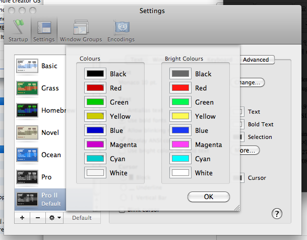

Title: Mac OS X 10.6.3 ( Snow leopard )에서 터미널 색상 바꾸기
Time: 11:19:00

맥을 바꿀때마다 하게 되는 일인 것 같다.

그런데, 이번엔 Snow leopard에 64bit라서 그런지 기존 플러그인이 작동이 잘 안되어 다시 한 번 구글링.

  

방법은 다음과 같다.

1. SIMBL (SIMple Bundle Loader) 설치.

2. SIMBL용 Terminal Colour plugin 설치.

  

10.6.3에 대응하는 SIMBL은 0.9.7a 이며, 다운로드는 다음의 링크에서 가능하다.

http://www.culater.net/software/SIMBL/SIMBL.php

  

SIMBL 0.9.7에 대응하는 Terminal Colour plugin은 원래 다음 경로에서 받을 수 있는데, 이는 최신의 Terminal
build에서 에러가 나며 실행되지 않는다. 단, 아래의 포스트 덧글들에서 확인할 수 있듯 info.plist에서
MaxBundleVersion을 272에서 273으로 변경하면 된다. 이를 첨부파일에 포함하였다. 실행되어 있는 터미널이 있으면 실행을
완전히 종료(Command+Q)하고, SIMBL 설치 후 ~/Library/Application Support/SIMBL/Plugins 안에
다운받은 번들을 넣고 터미널을 다시 시작하면 된다.

http://blog.fallingsnow.net/2009/08/28/fixing-colors-in-terminal-app-on-10-6/

  

설치가 정상적으로 되었다면, Setting > Text 탭에서 More 버튼을 확인할 수 있다.

  

  

