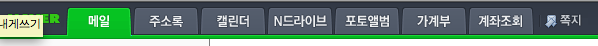

Title: 나와 같은 생각은 누구나 하고 있다.
Time: 12:04:00

아래 이미지는 예전 zigm
소개글([http://blog.naver.com/ez_/140103032943](../ez_/140103032943))에서 등록한 내가
생각하는 그룹웨어의 가상 이미지.

  
  
아래는 개편중인 네이버가 구성하는 GNB.

  
  
같은 생각을 하는 사람은 역시 정말 많다.

  
#1

다만 네이버에서 GNB에 픽토그램 혹은 아이콘을 왜 사용하지 않을까에 대한 의문은 든다.

커뮤니케이션 캐스트가 난잡해 보이는 것도 같은 이유일듯.

  
#2

올림픽에 사용되는 픽토그램들이 4년마다 나오고 있는데,

과연 몇개까지의 픽토그램을 연속적으로 구분해낼 수 있을까?

  
  

