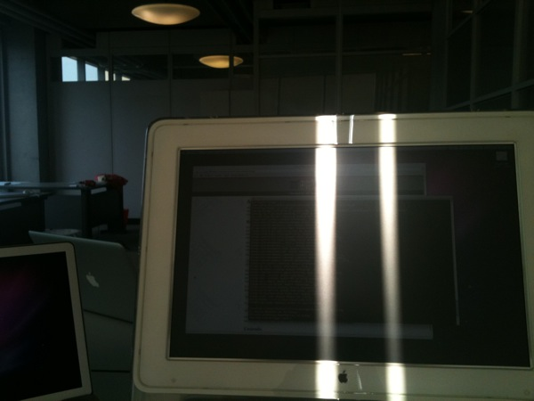

Title: 새 회사 분위기
Time: 15:56:00

사진과 함께 적어보는 새 사무실의 분위기.

서초동 삼성출판사 건물에 입주해 있습니다. 건물이 이제까지 있었던 인텔리전트 빌딩처럼 거대하지 않고 아담해서 맘에 드네요.

  

  
1층에 있는 초고가 이탈리안 레스토랑(적어도 제 기준에서는 -_-)입니다. 점심시간엔 구내식당으로 운영됩니다. 3천원에 점심을 해결할 수
있어 좋은데, 같이 식사하는 분들이 선호하지 않는군요. 그나저나 아직까지는 얻어 먹는 일이 많아 식비를 꽤 아끼고 있습니다.

  
  
  

  
천장까지 닿는 파티션을 세워 삼성출판사 편집팀과 공간을 구분 지었습니다. CI나 BI가 아직 없는 관계로 7층에 계신 자갈선녀(-_-)님께서
임시 안내문을 만들어 주신 것을 사용하고 있습니다. 덕분에 바로 옆 교육장에 온 외부인들이 출입하지 않고 있습니다. 감사합니다. (_ _ )

  
  
  

  
사무용 책상 8개 정도 들어가는 넓지도 좁지도 않은 공간입니다. 이전 회사에서의 경험을 살려 되도록이면 데스크탑 대신 노트북 지급을 전제로
하고 있습니다. 원래는 모니터를 옵션으로 하려고 했는데, 제가 불편해서 안되겠더군요. 저희 회사에 입사하시면 Macbook Pro 15"와
와이드 모니터로 일하실 수 있습니다. 이거 리쿠르팅인가요?

  
  
  

  
이전 회사에서는 책상에 파티션이 있어서 파티션 안쪽으로 선정리를 했는데, 파티션 구입을 안했더니 선정리가 어렵네요. 전부 애플 제품이다보니
코드도 어댑터도 전부 흰색. 저 무슨 멀티탭계의 앙드레김입니까...

  
  
  

  
큰 일(?) 할 때 옮겨주시고 도와주시는 아저씨가 계신데, 그분이 항상 데리고 다니는 몽실이!

  
  
  

  
개발 도구에 대한 투자는 확실히 하고 싶은데, 집기류에 대해서는 어쩐지 짠돌이가 됩니다.

IKEA의자 3,700원에 열개 사서 회사 대표와 함께 조립중. 회의실 의자도 일부러 같은 것으로 했습니다. 회의는 최대한 짧고 간결하게!

  
  
  

  
오후 4시가 되면 제 자리에 해가 듭니다. 일단 급한대로 집에서 쓰던 9년된 모니터를 가져왔는데 오래되서 그런지 해가 들면 잘 안보이네요.
그걸 핑계로 또 일 안하고 책만 봅니다.

  
  
  
  
  
  

