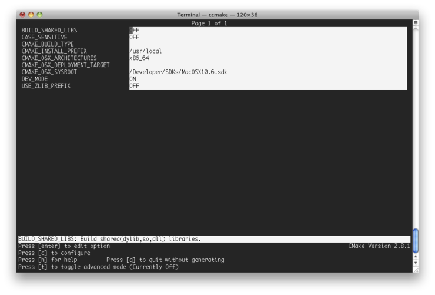

Title: Mac OS X + CMake 사용시 32-bit/64-bit 빌드를 결정하기
Time: 16:59:00

  
Mac OS X에서 ccmake를 실행하면 위와 같이 CMAKE_OSX 로 시작되는 OS X 전용 옵션이 나온다.

여기서 CMAKE_OSX_ARCHITECTURES를 변경해주면 32bit/64bit를 선택하여 빌드할 수 있다.

이 값은 C_FLAGS의 -arch 옵션 정의에 사용된다.

  
32bit : i386

64bit : x86_64

  
또는 추가로 ppc나 ppc64를 선택할 수도 있다.

  
  

