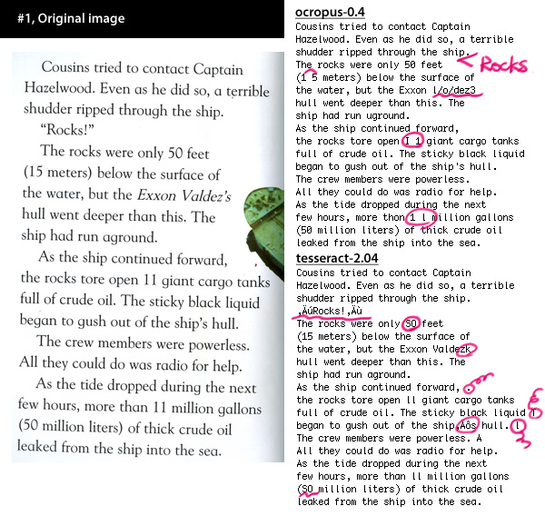
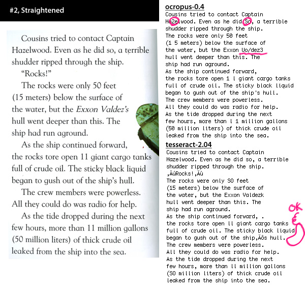
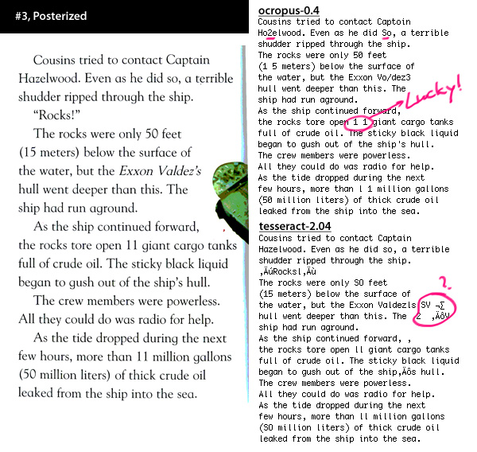
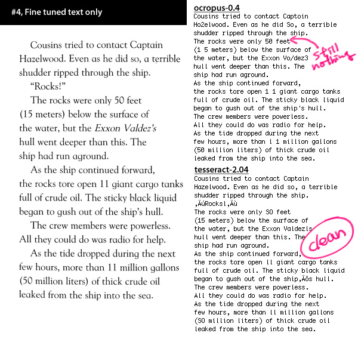

Title: ocropus and tesseract
Time: 18:54:00

open-source OCR toolkit에 대한 간략한 벤치마크.

OCR은 Optical Character Recognition의 약자로, 이미지로부터 문자를 추출해내는 기술을 말한다.

  
필요한 일이 있어, 오픈소스 OCR toolkit을 찾아보니 두 가지가 나온다.

  * ocropus
    * [http://code.google.com/p/ocropus/](http://code.google.com/p/ocropus/)
    * Google 지원 프로젝트이며, Google Books search에 사용되었다고 한다.
      * [http://en.wikipedia.org/wiki/OCRopus](http://en.wikipedia.org/wiki/OCRopus)
    * 위키피디어 정의에 의하면, 다음과 같다.
      * OCRopus(tm) is a state-of-the-art document analysis and OCR system, featuring pluggable layout analysis, pluggable character recognition, statistical natural language modeling, and multi-lingual capabilities.
      * 레이아웃 분석, 문자 인식, 자연어 모델링 등을 위한 프레임웍이라고 보는 것이 옳다.
  * tesseract
    * [http://code.google.com/p/tesseract-ocr/](http://code.google.com/p/tesseract-ocr/)
    * HP Labs에서 1985~1995년까지 진행한 프로젝트이며, 현재는 구글이 지원하고 있다.
    * ocropus 0.3의 기본 문자 인식 엔진은 tesseract 이었다고 한다.
일단 tesseract는 mac port([http://www.macports.org/](http://www.macports.org/))를
통해 최신 버전인 2.04를 손쉽게 설치하였으나, ocropus는 공식적으로 linux 특히, ubuntu linux 만을 지원하고 있어
Mac OS X에서 빌드해서 쓰기가 녹녹치 않았다. 다음의 링크를 참조하여 0.4 버전의 빌드에 성공하여 벤치마크를 진행하였다.

Mac OS X에서 ocropus-0.4 빌드하기 : [http://groups.google.com/group/ocropus/web
/compiling-ocropus-on-mac-os-x](http://groups.google.com/group/ocropus/web
/compiling-ocropus-on-mac-os-x)

  
  
비교에 사용된 컨텐츠 : DK Readers 중 일부 발췌, Epson Perfection 4000 series를 통해 200dpi로 스캔,
TIFF로 저장.

  

#1, 원본 이미지 ( 약간 회전됨 )

변환 시간 : ocropus 9.205s / tesseract 0.888s

ocropus : 특수문자(")가 포함된 줄 전체가 생략. 숫자 11을 1과 영소문자 l로 착각. 이탤릭체 인식 불능.

tesseract : 10배 빠른 인식 속도. 특수문자(" 및 ') 인식 실패. 이탤릭체에 대한 불완전한 인식. 숫자를 대부분 문자로 인식.

  
  

#2, 정상적으로 정렬된 이미지

변환 시간 : ocropus 8.813s / tesseract 0.701s

ocropus : 원본 이미지와 유사. 오히려 특정 문자(z->2, so->So)에 대한 인식 실패. 이탤릭체 불가능.

tesseract : 원본 이미지와 차이 없음.

  
  

#3, 노이즈가 제거된 이미지

변환 시간 : ocropus 9.034s / tesseract 0.907s

ocropus : 특정 문자에 대한 인식 실패는 여전.

tesseract : 노이즈가 제거되며 일반 이미지를 문자로 잘못 인식하는 문제 발생.

  
  
  

#4, 후처리를 통해 글자만 남긴 이미지

변환 시간 : ocropus 8.879s / tesseract 0.785s

ocropus : 별 차이 없음.

tesseract : 원본 이미지와 크게 다르지 않은 결과.

  
  
  
결론

  * tesseract가 ocropus의 자체 엔진보다 10배 빠르다.
  * 특수 문자 인식은 tesseract가 약간 낫다. ocropus는 특정 열을 아예 무시하는 문제가 있다.  

  * 숫자 인식은 ocropus가 약간 낫다. 별 의미 없는 차이.
  * 이탤릭체 인식은 tesseract가 낫다. ocropus는 품질이 낮음.  

  * 이미지의 상태나 정렬된 정도는 결과에 크게 영향을 주지 않는다.
그 외,

  * tesseract가 tiff만 받아들여 약간 불편.
  * ocropus는 다양한 이미지도 잘 받아들이고, 학습 기능이 있다. (사용해보지는 않음)  

  * 한글에 대한 인식 셋은 둘 다 없어 보임.
  
더 나쁜 이미지에 대한 테스트가 없는 것이 아쉽지만, 어느 정도 이상의 품질에서는 별 차이가 없다는 것을 확인한 것으로 만족.

  

