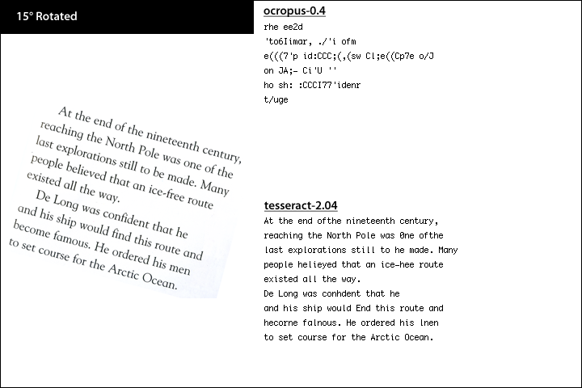

Title: ocropus and tesseract, #2
Time: 18:29:00

어제 두 OCR engine에 대해 맛만 봐서 아쉬움이 남아, 좀 더 테스트를 진행해보았다.

오늘은 격한(?) 상태의 이미지에 대한 테스트. 다음 번에는 문자 자체의 변형 외에 배경의 상태나 색에 대한 변경에 어떤 반응을 보이는지
추가로 알아보려 한다.

  
( 두 엔진에 대한 소개와 간략한 벤치마크는
[http://blog.naver.com/ez_/140110571493](../ez_/140110571493) 를 참조 )

  
지난 번 테스트와 마찬가지로, 비교에 사용된 컨텐츠는 DK Readers 중 일부 발췌, Epson Perfection 4000
series를 통해 200dpi로 스캔, TIFF로 저장.

  

  
  
결론

  * tesseract의 압승. original에서도 ocropus는 a를 자꾸 o로 착각한다.
  * 회전된 글자는 tesseract의 경우 20도 정도까지 받아들이는 듯.
  * 불규칙적인 형태로 깨진 경우가 역시 어렵다.

  

내가 ocropus를 뭔가 잘못된 형태로 쓰고 있는게 아닐까 싶은 정도인데...

덧) naver lab에 있는 OCR(http://t.lab.naver.com/ocr/)은 위의 이미지 중 절반 정도는 아예 이미지 인식
실패라며 결과를 보여주지도 않는다. 한글은 제법 하던데...

  

  
  

