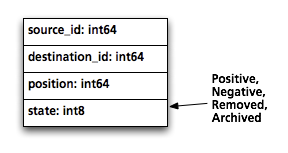
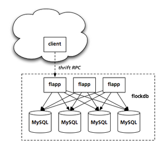

Title: Twitter에서 사용하는 FlockDB 소개 (번역)
Time: 19:14:00

[http://engineering.twitter.com/2010/05/introducing-flockdb.html
](http://engineering.twitter.com/2010/05/introducing-flockdb.html)

위 글을 열심히, 하지만 어설프게 번역해보았다.

오역이 있을 수 있으니 감안해주세요. 잘못된 해석에 대해 알려주시면 좋겠습니다.

  

  

트위터는 사람간의 관계에 관한 수많은 그래프를 저장한다. 당신이 누굴 팔로 하는지, 누가 당신을 팔로 하는지, 그리고 누구에게서 알람
메세지를 받았는지 등.

  

규모가 커짐에 따라 이런 그래프를 확장성 있게 보관하는 것이 도전과제였다. 예를 들어, 요청하고 승락하는(양방향,
facebook/cyworld) 관계 대신, 다른 사람을 그저 팔로 하면 되는 (단방향) 관계를 만들 수 있는데, 이에 제한이 없다 보니
대부분 적은 수의 팔로워를 가지고 있지만,@[aplusk](http://twitter.com/aplusk)와 같이수 백만의 팔로워를
가진사람도 있다.

  

트윗을 전달하기 위해 우리는 특정인의 팔로워를 찾아내고, 잽싸게 페이지 해야 한다. 또한, 이 와중에 엄청난 '쓰기' 트래픽과 팔로워의
추가/삭제, 스패머에 대한 처리도 감당해야 한다. @mention과 같은 특별한 경우엔 "누가 이 두 사용자를 모두 팔로 하고 있는가?"와
같은 연산도 처리해야 한다. 이와 같은 기능들은 전통적인 관계형-데이터베이스에서 구현하기가 까다롭다.

  

**  
**

다양한 노력

**  
**

우리는 초기에 관계형 테이블의 거친(험한) 사용과 비정규화된 키-값 저장소 등을 포함한 몇몇 저장 레이어(방법)들을 사용해봤다. 그 중엔
쓰기 성능이 좋거나 거대한 결과 셋을 페이징하는 성능이 좋은 경우가 있었지만, 둘 다 좋은 경우는 없었다.

  

1년여 전에, 우리는 시도해 볼만한새로운 것들을 찾을 수 있었다. 목표는 다음과 같았다.

  * 최대한 단순하게 만든다.
  * MySQL을 저장소 엔진으로 사용한다. (왜냐면 행동을 이해하고 있으니까) 메모리를 충분히 할당해 모든 것이 캐시에 있도록 한다.
  * 수평적 파티셔닝을 가능하게 하여, 규모가 커질 때에 하드웨어를 추가할 수 있도록 한다.
  * 쓰기 작업을 비 순차적으로 실행하거나, 한 번 이상 처리되도록 한다.

이렇게 FlockDB가 만들어졌고, 9개월 전에 마이그레이션을 완료하였으며, 이전으로 되돌린 적은 없다.

**  
**

**  
**

**더-다양한 노력**

**  
**

FlockDB는 그래프 데이터를 보관하는 데이터베이스지만, 그래프 탐색 작업에 최적화되어 있지는 않다. 대신에 엄청나게 큰 인접 리스트를
빠르게 읽고 쓰며, 페이징 가능한 쿼리들에 최적화 되어 있다.

  

  

이 DB는 그래프를 64비트 정수형 ID를 갖는 노드를 잇는 간선(edge)의 집합로 보관한다. 소셜 그래프에서, 노드 ID는 사용자 ID가
되지만, "favorite" 트윗에 대한 보관에서는 대상은 트윗 ID가 된다. 각 간선은 64비트의 position을 가지고 있어, 정렬에
사용한다. ("follwing"그래프에 대해서는 timestamp를 찍어둔다. 이를 통해 팔로워 리스트를 시간의 역순으로 보여준다. )

  
  

간선이 삭제될 때 실제로 MySQL에서 지우지는 않고, state 컬럼이 값을 '삭제됨'으로 변경한다. 이는 source_id(소스 ID),
state, position의 조합으로 구성된 primary key(PK)를 옮기는 효과가 있다. 비슷한 예로, 사용자가 계정을 삭제한
경우에도 실제 데이터를 지우지 않고 상태만을 변경하여, 다음에 되살릴 수 있도록 한다. (물론 사용 약관에 명시된 정도의 제한된 기간 정도만
보관한다) 우리는 멀티 컬럼으로 구성된 PK와 각 열을 나타내는 두번째 인덱스만을 이용하여 모든 쿼리를 단일 인덱스로 응답할 수 있도록
했다. 이런 류의 스키마 최적화는 MySQL을 멋지게, 예측 가능한 성능을 내도록 한다.

  

"내가 팔로 하는 사람들 중 오바마 대통령을 팔로 하는 사람은 누구인가?"와 같은 복합 쿼리는 "오바마 대통령을 팔로잉 하는 사람은
누구인가"의 단일 사용자 쿼리들로 분해하여 빠르게 응답할 수 있도록 한다. 데이터는 노드 단위로 파티션 되어 있기 때문에, 각각의 쿼리는
indexed range query를 사용하여 단일 파티션 단위로 수행될 수 있다. 같은 방법으로, 긴 결과 셋에 대한 페이징도
LIMIT/OFFSET을 사용하는 대신 position 필드를 커서와 같이 사용하기 때문에, 결과의 어떤 페이지라도 인덱스되어 빠르게 보여질
수 있다.

  

쓰기 작업은 글을 남기는 시간에 기반한
멱등적([idempotent](http://en.wikipedia.org/wiki/Idempotence)/ 역주:같은 처리를 여러번 해도
결과가 같음)이며, 가환적([commutative](http://en.wikipedia.org/wiki/Commutative)/ 역주:순서를
바꾸어도 결과가 같음)인 작업으로 이루어진다. 요청을 순차적으로 처리하지 않아도 같은 결과를 가지게 되었고, 이 덕에 일시적으로 네트워크나
하드웨어의 문제가 있을 때에 - 심지어는 몇 분, 몇 시간 전에 잃어버린 데이터를 재생하는 경우에도 도움이 되었다. 이는 특히 서비스 초기에
큰 도움이 되었다.

  

가환([commutative](http://en.wikipedia.org/wiki/Commutative))적 쓰기 작업은 새로운 파티션을
올리는 작업을 단순하게 만든다. 새로운 파티션은 곧바로 '쓰기' 트래픽을 받아들이게 되고, 동시에 기존 파티션으로부터 데이터를 느긋하게 전달
받는다. 덤프(복제) 작업이 완료되면 이 파티션은 바로 '라이브' 상태로 돌입하여 '읽기' 요청도 처리할 수 있게 된다.

  

스칼라(Scala)로 작성된 애플리케이션 서버('flapps')는 stateless하고, 수평적으로 확장 가능하다. 이 덕에 데이터베이스와는
독립적으로 쿼리 증가에 맞춰 서버를 증설할 수 있다. flapps에서는 적은 수의 API만을 노출하고, Ruby로 작성된 클라이언트([a
Ruby client](http://github.com/twitter/flockdb-client))로 풍부한 인터페이스를 제공하도록 하였다.

  

  

우리는[Gizzard](http://github.com/twitter/gizzard)라이브러리를 통해 파티셔닝 레이어을 다룬다. 포워딩
레이어는 소스 ID의 범위를 물리 데이터베이스들에 맵핑하는 역할을 하며 같은 포워딩 주소하에 있는 테이블들의 트리를 만들어
리플리케이션(복제) 작업을 수행한다. 쓰기 작업은 지역적으로 저널(기록)된 이후에 인식된다. 이 덕에 데이터베이스의 가용성이나 성능 분리의
문제를웹 사이트의 응답 시간과 무관하게 만들었다.

  

간선은 실제로는 "정방향" (소스 ID 기준)과 "역방향" (대상 ID 기준)으로 두 번 저장된다. 그래서 "내가 누굴 팔로 하는가?"와
"나를 팔로 하는 사람은 누구인가?"에 대한 쿼리를 하나의 파티션 상에서 처리할 수 있다.

  

이러한 결과로 우리는 서버를 필요한 시점에 원활히 추가할 수 있게 되었다. 지난 겨울에 우리는 서비스에 지장을 주지 않고 50%의
데이터베이스 용량을 추가하였다. 현재 **130억개 이상의 간선**을 보관하며, 최대 **초당 2만회의 쓰기 작업과 10만회의 읽기
작업**을 처리하고 있다.

  
**  
**

**교훈**

**  
**

의도한 목표와는 무관하더라도, 이러한 경험을 통해 몇가지 쓸만한 패턴을 얻었다.

  

  * long tail을 잘라내기 위해 공격적인 타임아웃을 적용한다.  
시스템적인 불공평함을 완전히 배제할 수 없으므로, 어떤 요청은 처리되기까지 이유 없이 너무 긴 시간이 걸릴지도 모른다. 여러 개의
stateless 애플리케이션 서버가 있다면, "납득 가능한" 시간을 초과하여 걸리는 요청은 일단 중지하고 다른 서버에게 맡기는 것도
방법이다.

  * 모든 예외 상황을 에러로 간주한다.  
또는, 에러에 대해 일반적인 작업과 같은 코드 패스를 사용하도록 해라. 적어도 뭔가 새로운 시도를 하고 싶을 때에 비상시에 걸리적거리기만 할
임시 모듈은 만들지 않는 것이 좋다. 우리는 쓰기 작업을 ([Kestrel](http://github.com/robey/kestrel)을
라이브러리로 사용하여)로컬 큐에 보관하고, 문제가 발생했을 때는 별도의 에러 큐에 기록한다. 에러 큐 내의 작업들은 주기적으로 다시 쓰기
큐에 넣어져 처음 시도했을 때 같은 코드 패스를 따라 재시도를 하게 된다.

  * 처음부터 자동화 하려 하지 말아라.  
측정할 수 있는 많은 수단(게이지와 레버 같은)을 제공하고, 패턴이 나왔을 때 스크립트를 통해 자동화 할 수 있도록 해줘라. FlockDB는
각 서비스(MySQL, Kestrel, Thrift)를 넘나드는 각 쿼리에 대해 지연값(latency)를 모두 측정한다. 이를 통해 타임아웃
값을 조정하기도 하고, 각각의 요청 수를 보고받아 클라이언트 라이브러리부터의 요청이 갑자기 두 배가 되는 때를 확인할 수 있다.(하드웨어
추가가 요구되는 시점) 에러 큐에 쌓이는 쓰기 작업 실패에 대해서는 수동으로 확인하기 위해 로그를 생성하기도 한다. 만약에 버그로 밝혀진다면
찾아내 고칠 수 있고, 실패한 작업을 다시 넣어줄 수 있다. 또는 클라이언트의 문제로 밝혀진다면 그 자체로 좋은 버그 리포트가 된다.

  
**추가 정보**

**  
**

프로그램 소스는github를 통해찾아볼 수 있다.

[http://github.com/twitter/flockdb](http://github.com/twitter/flockdb)

  

이런 류의 데이터가 어떻게 저장되는지에 대해 더 궁금하다면 아래의 데모를 통해 확인해보길 바란다.

[http://github.com/twitter/flockdb/blob/master/doc/demo.markdown](http://githu
b.com/twitter/flockdb/blob/master/doc/demo.markdown)

  

우리와 IRC에서 대화하고 싶다면#twinfra (irc.freenode.net)채널에 참가하거나 다음의 메일링 리스트에 가입하면 된다.

[http://groups.google.com/group/flockdb](http://groups.google.com/group/flockd
b)

  

