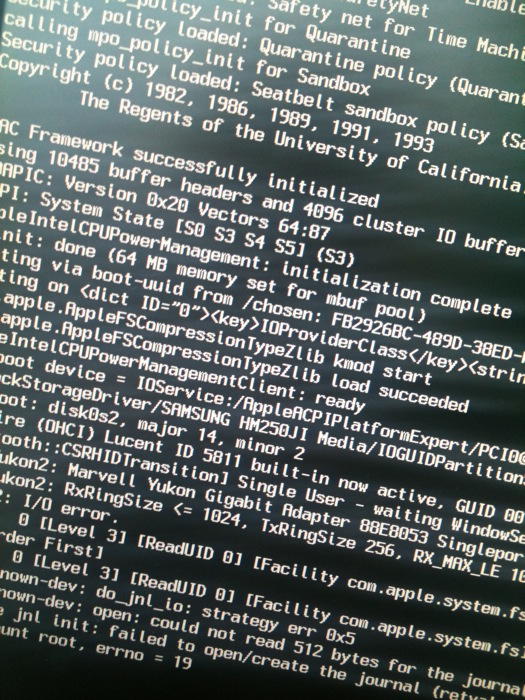
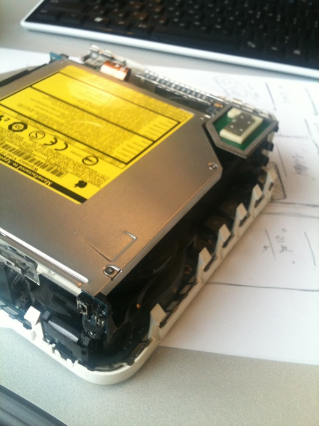
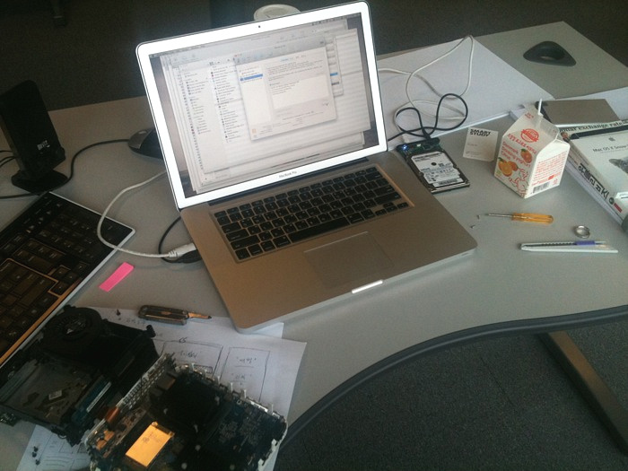

Title: 스마트 에디터 2.0 테스트
Time: 16:18:00

스마트 에디터 2.0이 베타를 시작해서, 글을 한번 써본다.

  

일단 메뉴가 위로 올라가며 편집 상태와 출력 상태의 가로폭이 달라지는 어이없는 일은 없어졌다.

그러나... 여전히 내 스킨에 맞는 가로폭의 편집기가 제공되지는 않는다. 너무하지 않나?

+

드디어! 사파리에서 사진 업로드가 된다. 물론 이것도 당연히 되야하는 것인데 안되던 것.

그러나... 사진 보정에 '밝기' 수정은 있는데 '대비' 수정이 없다. 어처구니 상실.

사람들이 '색상'이나 '채도' 보다 '대비'를 더 많이 수정한다는 사실을 몰랐던 걸까?

+

편집 상태일 때 글씨는 고딕, 출력 상태일 때 글씨는 명조. 맥+사파리는 그냥 무시하는 듯.

글씨 크기 달라지는 것도 맘에 안들지만 세리프/산세리프까지 달라지면 어쩌라는 걸까...

  

90% 까지 잘 만들어 놓고 이렇게 마무리를 잘 못하니. 쩝.

  

아래 사진은 집에서 쓰던 맥미니가 고장나 회사로 가져와서 고치는 중.

하드가 마운트가 안되는 문제가 발생하여 결국 본체 분해.

  

한나절 금방 지나가네.

  

에러 번호 19. 검색해보니 유사 문제를 겪은 사람이 좀 있더라.

그래도 사진 여러장 올릴 때, 중간에 
로 줄 띄워주는 센스가 있네.

아무튼 맥미니는 분해하기 어렵다. 칼로 밑면을 후벼파야 겨우 분해됨.

디스크 유틸리티로 복원중. 디스크 자체에는 문제가 없다는데 왜 마운트가 안될까. 일단은 가지고 있던 다른 디스크를 넣어 포맷 후 재설치중.

  

