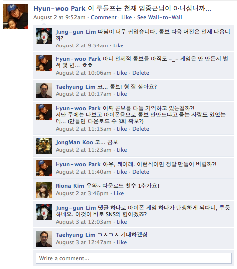
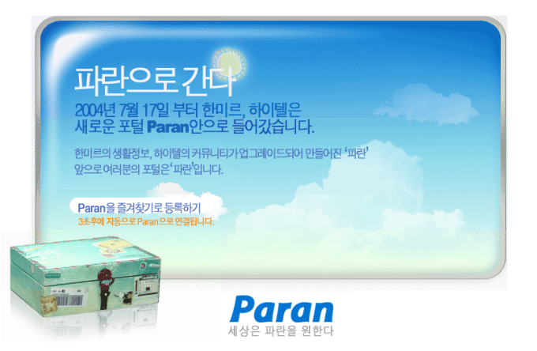
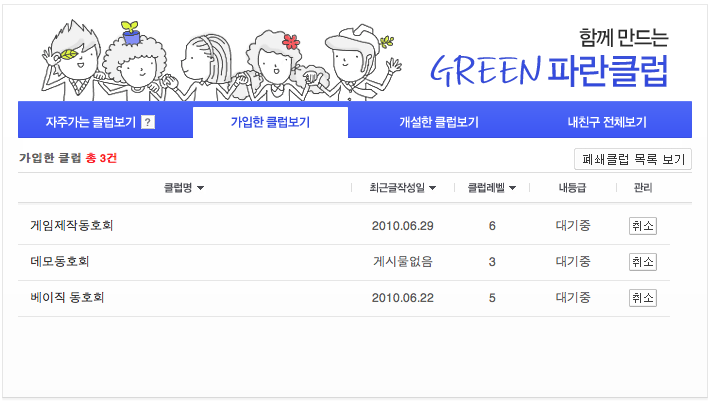
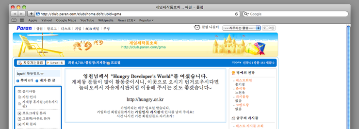
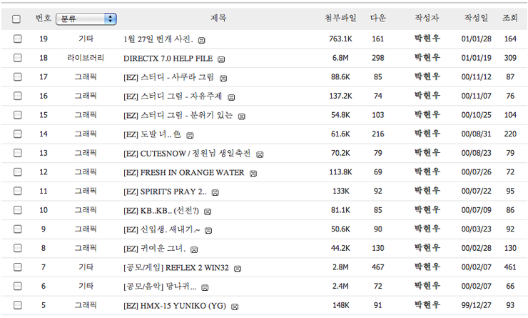
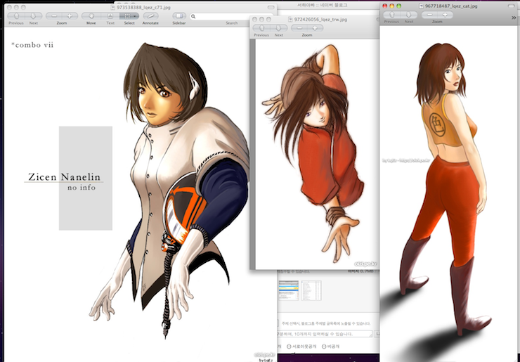
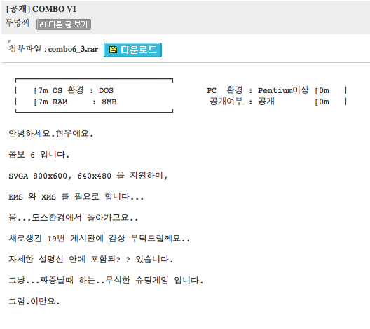
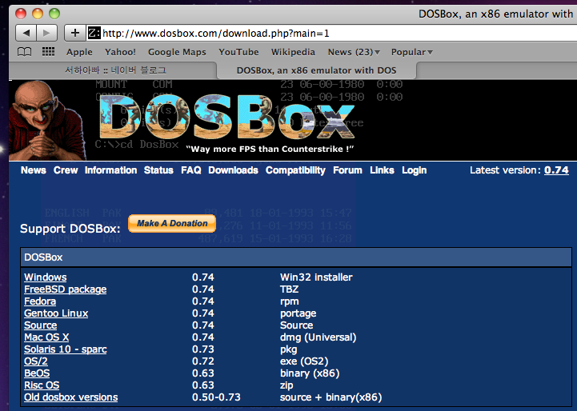

Title: combo
Time: 00:47:00

얼마 전 페이스북에서 이런 일이 있었다. 오랜만에 만난 사람이 있어 인삿말을 남겼는데...

대화의 등장인물들은 십여년전 고등학생 시절, '서울시 컴퓨터 경진대회'라는 묘한 이름의 대회에 같이 참가했던 사람들이다.

  

  

이 대회는, 몇 개의 알고리즘 문제에 대해 제한시간 내에 해당 문제를 풀이하는 프로그램을 작성해 디스켓에 제출하여, 높은 점수를 받은
사람부터 상을 받게 되는 방식으로 치뤄진다. 인터넷도 제대로 없던 시절(가까스로 PPP)이라 대회를 치루려면 일단 같은 장소에 모여야 했다.

  

게다가 컴퓨팅 환경이 잘 갖춰진 곳이 없어, 수십~수백명의 참가자가 각자 자신들의 컴퓨터를 들고 와 모여야 했다. 나도 예전에 아버지께서
대회날 아침에 차 뒷자석에 컴퓨터와 모니터를 넣고 바래다 주셨던 기억이 난다. ( 아버지 감사합니다. ㅠㅠ )

  

일단 모이긴 모였는데, 뭘 암기하는 대회도 아닌데다 학생들이다 보니 역시 게임 이야기를 주로 했었다. 또, 대회 시작하기 전까지 심심하니
다들 게임을 하며 놀곤 했는데, 그 와중에 나는 자작 게임을 홍보하러 다녔던 모양이다. 위 대화에서 언급된 게임이 바로 그 때 디스켓으로
복사해주던 슈팅 게임, '콤보'. 정확히는 콤보 6탄.

  

콤보 1탄은 중 3때, 운 좋게 전국 대회에서 괜찮은 성적을 거둬, 아주대에서 진행되는 세계 올림피아드 대회(IOI) 합숙 훈련에
참가했었는데, 그 훈련 기간 중 만들었던 게임이다. 방학 기간 중, 10일 이상 합숙했던 것 같은데 너무 지겨운 데다가, 다른 친구들은 당시
유행하던 워크래프트2를 랜플레이 하는데, 당시에 나는 그 게임이 너무 재미가 없어......는 아니고 숫기가 없어 복사해달란 말을 못해 뭘
할까하다, "없으면 만들어서 하겠다!" 는 마음으로 게임을 만들어서 즐겼다. 이 때문인지는 모르겠으나, 난 합숙 성적도 별로 였고, 숙제도
잘 안한 탓에 대표팀에서는 탈락. 그 이후로 IOI와는 인연이 없었다. 바이바이.

  

아무튼, 그곳에서 만들었던 게임을 이후 몇 년간 6편까지 만들었고, 고 3때 비슷한 게임을 만들던 친구와 합작해 최종적으로 Bug vs
Combo라는 게임으로 발전시켰다. 이 게임은 그 해 성균관대 게임 공모전에서 대상을 수상했고, 프로그래밍을 담당했던 친구는 성대에 특차
합격했으나... 졸업은 안하고 아직 XBOX 게임 열심히 만들고 있는 것으로 안다. 지호야 뭐하니...

  

  

  

이제 사설은 그만하고,얘기가 이렇게 나왔으니 아이패드/아이폰 용으로 진지하게 만들어볼까... 가 아니라 일단 해봐야 겠다는 생각이 들었다.
허나, 소스 코드는 커녕 실행 파일도 찾을 수 없았다. 얼마 전까지 가지고 있었다고 생각했던건 기분 탓인가... 예전에도 실행 파일을 하이텔
게제동(GMA!) 자료실에서 받았던 기억이 나, 하이텔로 찾아가봤다.

  

그래.. 파란으로 가라. 어쨌든 하이텔 아이디로 로그인은 된다.

  

  

  

  

로그인은 했는데, 내 등급은 전부 '대기중'. 맞다, 예전에 하이텔 없어진다고 했을 때 탈퇴했다가 재가입 했었지... 그래도 게제동 자료실은
쓸 수 있는데, 나머지는 아예 쓸 수가 없다. 제발 가입 좀 시켜달라구요. 벌써 몇 년 기다리는 건지.

  

  

  

  

게제동 입장 성공. 과거 하이텔의 ANSI화면에 비하면 조악하지만 아직 게시물과 자료를 보관해주는 것은 대단한 고객 감동 서비스라고
생각한다. 그래도 제발 가입 좀 시켜줬음 좋겠는데, 이건 몇 년째 동호회를 안 들여다보는 시삽 탓...

  

  

  

  

이름으로 검색해봤는데, 콤보는 없고 1999년과 2000년 사이에 그렸던 이상한 그립들만 잔뜩 있다. 기억 난다. 타블렛 사서 잘도 그렸고,
부끄러운 것도 몰랐는지 잘도 업로드 해놨다. 이제와서 지울 수도 없고 -_-

  

  

  

  

역시 기계 아니면 여자만 그렸다. 어이구. 저 이상한 읽을 수도 없는 이름은 뭐고, 머리카락엔 왠 허연 음표가 있으며, 왼쪽 눈은 어디에
붙어 있는 건지...

아무튼 까먹었던 건데, 저 그림 구석에 'combo vii' 글씨가 있다. 7편을 만들려고 마음은 먹었던 모양.

  

  

  

  

제목으로 검색해서 드디어 찾았다. [7m [0m 같은 ANSI코드를 오랜만에 본다. 옛날이여. 요즘 친구들은 US기준 ASCII코드
172,173,174의 아름다움을 모르겠지. 당시 노턴이 라인 드로잉의 왕이었는데. 그나저나 설명선? 포함되? ?, 짜증날때 하는? 뭔
소린지 이해할 수 없는 설명 글. 조합형에서 UTF-8, CP949, EUC-KR로 옮겼다고 저렇게 달라지진 않을텐데...추억에는 그만
젖어들고, 이제 그만 파일 다운로드.

  

  

  

도스가 없으니, 도스 게임을 하려면 dosbox가 진리. 맥용도 이미 빌드된 설치본이 있다. 친절하구나.

  

  

  

  

  

글이 너무 길어진다.

  

오늘은 여기까지만 쓰고, 내일은 플레이 영상을 올려봐야겠다.

이렇게 정리하다 보니, 진짜 이 게임의 7편을 만들고 싶다는 마음이 든다.

어디까지나 마음만.

  

  

  

  

