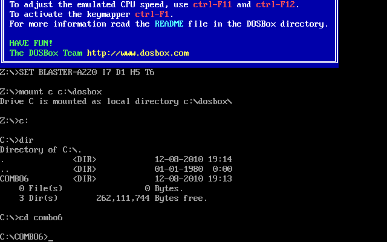
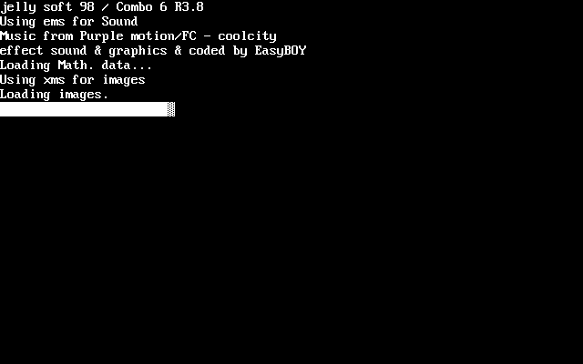
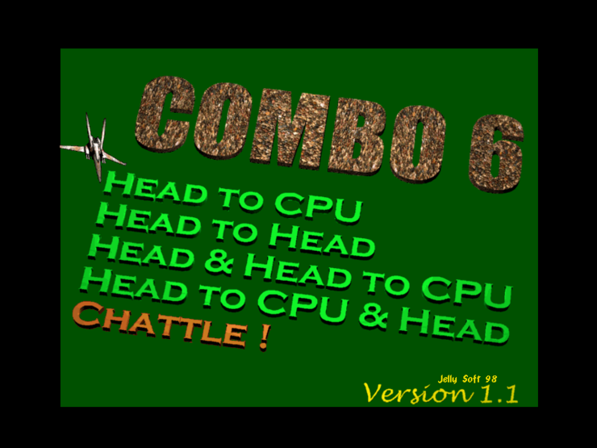
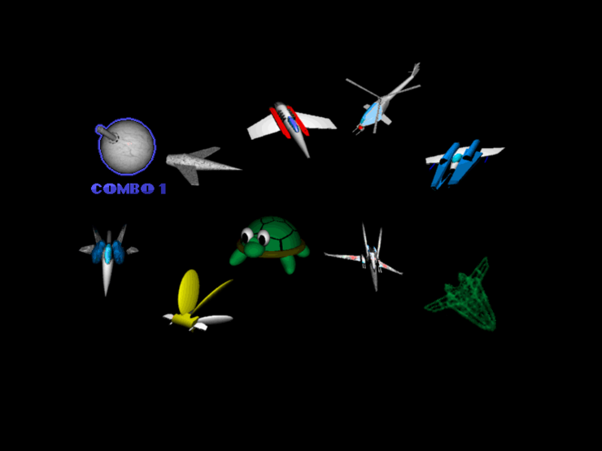
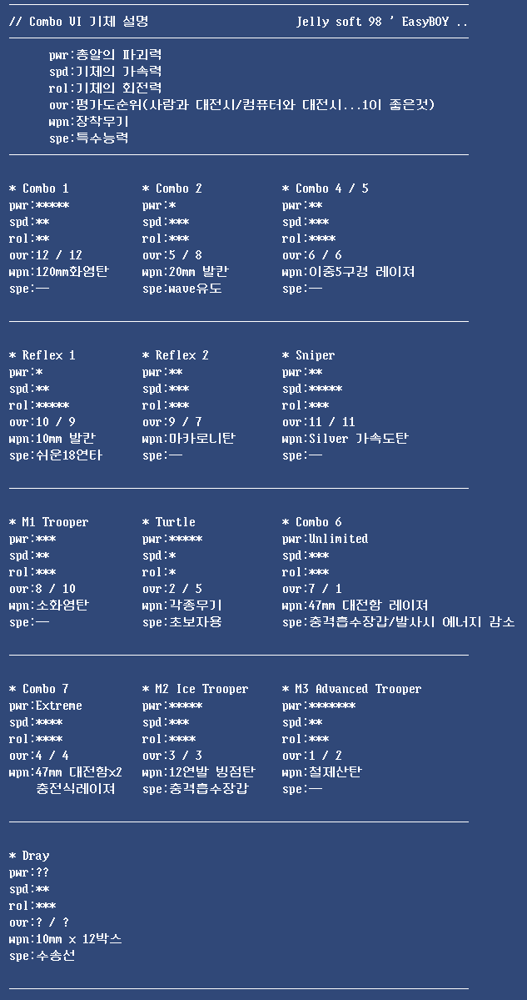

Title: combo #2
Time: 10:34:00

dosbox를 통해 예전 게임을 다시 돌려보니 묘한 기분이 든다.

저 시절부터 어긋났었나 싶기도 하고... 아무튼, 반갑다.

  

  

도스박스 실행화면. SET BLASTER라니.. A는 주소일꺼고, I는 인터럽트, D는 DMA인 것 같은데 나머지는 모르겠네...

  

예전 도스 게임 만들 때는 저런 화면 출력하는게 약간의 로망이었다.

와컴C로 빌드된 게임(예:C&C)보면 DOS4GW 어쩌고... 나오는 화면이 멋있어 보여서 흉내냈던 기억이 난다.

  

나는 이때까지 퀵베이직만 썼었고, 덕분에 메모리 관리가 무척 어려웠다.

주 메모리도 부족하고, 단일 배열의 최대 크기가 64k이상 안되었었다. 32k였던가...

따라서, XMS나 EMS같은 확장 메모리를 사용하려면 C로 또는 어셈블리어로 제작된 외부 라이브러리를 끌어다 썼야했는데, 이젠 이름이 기억이
안난다. 뭐였더라?

  

하이텔 아이디가 LqEz였는데, 그 이전 천리안에서 썼던 아이디인 EasyBOY로 제작자가 적혀있다.

음악은 아미가 음악의 대부격인 Purple motion(Future crew)님의 음악을 차용했었는데, 당연히 동의는 구하지 않았다. ^^

  

마지막의 로딩 그래프는 역시 ASCII code 172,173,174,219.

  

모델링의 M자도 모르고, 렌더링의 R자는 더욱 모르던 시절.

책도 한권 없이 그냥 맨땅에 헤딩하며 만들었는데, 요새는 그런 버릇이 많이 줄었다.

이게 좋은 건지 나쁜 건지... 요즘은 돌다리도 너무 두드려보고, 건너다가도 두드리고 하는 기분이다.

  

생각해보니 게임은 도스 게임인데, 렌더링/모델링은 윈도우에서 했었던 것 같다.

아마 모델링은 Rhino, 렌더링은 3DS Max를 썼을 듯. 라이센스야 뭐... ^^

  

1인 모드 외에 2인 경쟁 모드, 협동 모드 그리고 실력 차이가 나는 사람끼리 같이 하기 위해 사람 vs 사람+컴퓨터의 모드도 존재한다.

온라인 게임이 흥하기 전에는 이와 같이 PC 게임에서 2인 모드를 지원하는게 너무 당연했다.

허나, 키보드만 지원하는 액션 게임류에서는, 동시 입력 제한으로 인해 키 배치하는 것에 꽤나 신경쓰기도 했고. 콤보도 그 문제에서 벗어날 수
없어, 상대방이 키를 어떻게 누르냐에 따라 회전을 제대로 못했었던 것 같다. ㅋㅋ

  

  

콤보 6는 기존 콤보 시리즈를 비롯해, 이전에 만들었던 슈팅 게임의 캐릭터를 모두 등장시켰다.

이전 글에서 언급했던 Bug vs Combo라는 게임에는 이보다 더해, 이 캐릭터들에 추가로 친구가 만들었던 게임의 캐릭터까지 더해져 나름
마벨 VS 캡콤과 같은 분위기를 냈다. 캐릭터별 특성이 다 따로 있는데, 그 스펙 시트까지 압축 파일에 포함되어 있었다. 진지했네. ㅎㅎ

  

  

일단 플레이는 해봤고, 재미가 없지는 않다.

이걸 아이패드나 아이폰에서 어떻게 입력 인터페이스를 구현할까에 대한 의문이 가장 먼저 든다.

  

