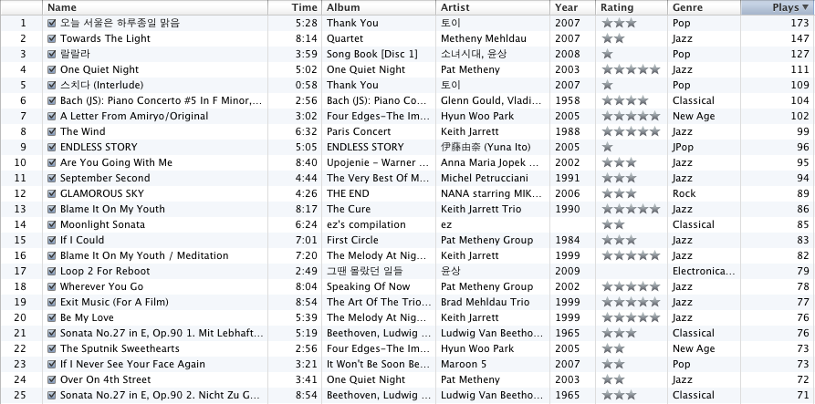

Title: iTunes 많이 재생한 음악 목록 25
Time: 14:36:00

듣는 음악이 다양하질 못해, 작년 플레이리스트랑 비교해봐도 크게 달라진 건 없어보인다.

그래도 몇 가지 곡에 대해 적어본다면.

  

  

**Towards The Light** / Quartet(2007) - Metheny Mehldau

팻 메쓰니와 브래드 맬도가 기타/피아노의 듀엣으로 낸 첫 앨범 'Metheny Mehldau(2006)'에도 Ring of Life, Say
the Brother's Name과 같은 드럼/베이스가 포함된 쿼텟이 두 곡 포함되어 있었지만, 내친 김에 아예 쿼텟이 메인인 앨범을 추가로
발매했는데, 이 앨범에도 좋은 곡들이 가득. 전작에 비하면 PMG의 앨범이라고 해도 무방할 정도로 펫 메쓰니의 색채가 강한 것이 맬도
팬들에게는 아쉬울 듯. 곡의중반부에 클라이막스가 나오며, 이후 드럼이 주가 된파트가 나오며 정리, 이후에는 A를 반복하며 곡을 끝낸다. 주로
퇴근할 때 듣는데, 듣고 있으면 마냥 가슴이 두근두근 거린다. 꼭 무슨 일이 시작되기라도 할 것 처럼.

  

  

**Loop 2 For Reboot** / 그땐 몰랐던 일들(2009) - 윤상

윤상 6집의 마지막 곡. 세 트랙 앞에 있는 My Cinema Paradise에서 보컬만 뺀 곡으로 받아들이는 사람도 있겠지만, 나에게는
전혀 다른 곡으로 들린다. 윤상의 'insensible' 이후 대부분의 곡들과 마찬가지로 다양한 대역에서 나오는 풍부한 전자음 속에 귀에
박히는 멜로디가 인상적인 작품. 30초 지점과 1분 20초 즈음에 나오는 뒤로 차분하게 깔리는 리드 멜로디가 마음을 따뜻하게 해준다. 파이널
판타지 5편의 오프닝을 처음 봤을 때의 느낌을 전해주는 음악. A 주제만 두 번 반복하고 짧게 끝나는 것이 못내 아쉽다.

  

  

  

이건 딴 소리지만... 이제 '랄랄라' 소녀시대 버전에서 9명의 목소리를 대충 구분할 수 있게 된 것 같다. --;

