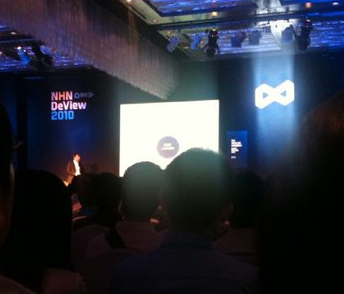

Title: NHN DeView 2010 후기
Time: 19:14:00

찍은 사진이라곤 이거 딸랑 한 장.

**  
**

**1. 인사말 - 김평철 CTO님**

**요약 : 도무지 이해할 수 없는 인사말.**

  

덜 정리된 발표 자료. 특히 미투데이 글을 보여주는데 들어간 불필요한 애니메이션. 오픈캐스트에서 본 듯한 롤링 이펙트를 과도하게 사용해
프레임 레이트도 안나오고, 제어도 안되어 산만한 진행에 일조함.

  

게다가 더 심한건 내용. 핵심 기술을 가진 코어 개발자가 되자는 의미로 말씀하신 듯 한데, 코어 개발자가 되기 위해 어떤 노력이 필요한지,
소개에 나온 사람들이 어떤 과정과 도전을 통해 그 자리에 도달했는지에 대한 언급은 없고, 무조건 성공하면 닭집 차리지 않는다는 식의 진행은
무리. 시간이 부족했어도 왜 코어 개발자가 되어야 하는가에 대한 이야기는 더 필요했다고 생각함. 그리고 코어 개발이 아니라 패키지 개발이라고
(실수였겠지만) 얘기하는 것도 우스웠음.

NHN에도 코어 개발자 말고 서비스 개발자가 훨씬 많지 않나? 이들에게도 미래를 보여줬음 좋겠는데.

  

프로그래머의 일평균 작성 라인수 같은 얘기는 왜 꺼냈을까. CTO님이 그런 생각을 가지진 않겠지만, 이 얘기를 듣고 돌아간 다른 사람들이
혹시라도 그런 M/M스러운 생각을 할까 두렵다. 어후.

  

홈페이지의 인삿말을 굳이 되풀이할 필요는 없었겠지만, 차라리 그걸 육성으로 (멋있게) 해주셨으면 좋았을 것 같다.

  

  

  

**2. 키노트 : 건강한 소프트웨어 - 김정민 이사님**

**요약 : 교수님 강연 듣는 기분. NHN과 같은 큰 조직에서도 애자일스럽게 잘 해나가고 있구나. 멋지다.**

**  
**

지속적인 통합을 주제로 많은 이야기를 비교적 짧은 시간내에 잘 풀어낸 발표. 중간 중간 가벼운 유머도 좋았고, 멋있었다. 다만, 내용이 워낙
많다보니 발표자료가 효과적으로 구성되어 있지 못했고 - 프로젝터 화면과 청중의 거리가 먼데 비해 글씨나 도형이 너무 작고, 한 화면에 정보가
너무 많았음 - 비개발자의 경우나 애자일 용어에 익숙하지 않은 개발자들은 듣기에 좀 버거웠을 듯.

  

피보탈 트래커([http://www.pivotaltracker.com/](http://www.pivotaltracker.com/))에 관심이
있어, 이전 회사에서 작은 규모로 써보았는데, 이런 애자일 개발 도구를 전사적으로 소화해내고 있는 실행력이 놀랍다. 일의 크기를 예측하는데
사용된다는 플래닝 포커([http://www.planningpoker.com/](http://www.planningpoker.com/))는
써보지 않았는데, 관심이 감.

  

추가적으로 NHN에서 사용하고 있는 코딩 컨벤션이나 가이드라인을 디자인 가이드라인 공개하듯 한 번 공개해줬으면 좋겠다. (구글은 공개하고
있음 : [http://code.google.com/p/google-styleguide/](http://code.google.com/p
/google-styleguide/)) 책에 있으려나?

  

  

  

**3. 치명적인 데이터베이스 장애, 어떻게 극복할까 - 김성규님**

**요약 : MySQL 좀 적당히 미워하세요. 큐브리드 HA 잘 되네요.**

  

큐브리드 HA에 대한 트랙. 치명적인 데이터베이스 장애라면 사실 좀 더 치명적인 상황을 만들어서 보여줬으면 좋았을 것 같은데, 현장에서
PT용으로 사용중인 노트북내에 VM 2개를 띄워, 리플리케이션 구성하고 서버 하나 내리는 테스트를 진행했다. 웹 페이지에 참가자들이 글을
남기는 테스트를 했는데, 웹 서비스 자체가 엄청 느려 테스트에 참가하기가 어려웠다. 나도 글을 남기고 웹 브라우저가 더 이상 갱신되지
않길래, 포기하고 있었는데, 1분쯤 후에 내 글이 화면에 나타났다. -_- 덕분에 컵은 하나 얻었지만 어딘가 꺼림칙.

  

그나저나, 큐브리드는 원래 3-tier 구성이고, 마찬가지로 MySQL도 MySQL Proxy 포함하여 3-tier구축하면 failover가
동일하게 되는데, 발표자료에서는 (기본적으로는) 불가능하다는 식으로 표현했다. 물론 발표 내용에서 별도의 소프트웨어를 사용하면 가능하다는
얘기를 했지만 약간은 억지. 이에 대해 비공식 큐브리드 카페([http://cafe.naver.com/studycubrid.cafe](htt
p://cafe.naver.com/studycubrid.cafe)여기가 공식은 아니겠지?)에 질문을 올렸지만 같은 답변만을 들었다.
"큐브리드는 원래 3-tier구성이고, MySQL은 별도로 구성해야 한다는 점에서 그렇게 표시했습니다." 라고.

  

Q&A시간에 물어보고 싶은 것이 많아 손을 번쩍 들었지만, 시간관계상 종료한다는 말에 GG. 카페에서 질답을 진행하고 있다. 어차피
큐브리드와 MySQL의 성능 테스트를 진행하려고 했으니, 질답 충분히 한 다음에 진행하고, 글을 또 남겨봐야겠다.

  

  

**4. RTCS : 실시간 웹서비스 - 김경윤님**

**요약 : comet + long polling을 우리도 구현해봤다. 끝. 그리고 플래시 신맞고에 낚이지 마라.**

  

<strike>일단 한게임 신맞고를 웹페이지에서 보여준 탓에, "꽤 잘만들었네?" 하고 다들 생각했을텐데, 일단 HTML5가 아니라
플래시임. (별로 중요한 건 아니지만, 그래도 낚이는 사람 있을까봐) 플래시의 HTTP Request 혹은 RTCS 클라이언트와 RTCS
서버로 구성된 것이고, 나머지 애니메이션과 효과음 처리는 플래시인 것으로 보임.</strike> 애니메이션은HTML/JS/CSS이고,
사운드만 플래시라고 합니다.([http://twitter.com/redstrato/status/24267775407](http://twitt
er.com/redstrato/status/24267775407)) 잘했네요. 앞으로 만들 HTML기반 보드/카드 게임류가 기대됩니다.

  

Comet + Long polling의 조합으로 우리도 게임 테스트 한 번 해봤고, 이런 서비스를 통해 웹에서 Synchronous 한
서비스를 구현할 수 있을 것 같다는 얘기를 했음. 다만, 같이 들었던 사람도 헷갈려한 polling에 비해 long polling이 무엇이
다른가? 에 대한 설명이 조금 빠진 듯. 이것은 다음 링크를 참조.([http://en.wikipedia.org/wiki/Push_techn
ology#Long_polling](http://en.wikipedia.org/wiki/Push_technology#Long_polling)
, 요약하면 polling은 클라이언트의 요청에 서버가 즉시 응답을 줘야 했지만, long polling은 서버가 새롭게 응답할 내용이
없다면 응답을 바로 안하고 기다렸다가, 줄 내용이 생기면 응답해주는 방식이라는 것.)

  

  

  

  

  

**후략**

  

약속이 있어... 는 아니고 들을만한 트랙이 없는 것 같아 앞의 두 트랙만 듣고 딴짓했는데, 나중에 보니 arcus를 못 들은 것이 좀
아쉽다. 다만 발표자료가 상대적으로 잘 되어 있어 다행이다.

  

1.

다른 데뷰 후기에서도 많이 나온 얘기지만, 사전 등록을 왜 했는지 모르겠다. 대부분의 트랙에서 바닥에 앉거나 뒤에 서서 보는 사람이 많았다.
트랙 D는 유난히 작은 방에서 진행한 탓이 더 그랬고. 카메라맨이 돌아다니는 사람을 무지하게 경멸함. 아, 물론 생중계가 훠얼씬 중요하니까.
인정. 허나 그럴꺼면 애초에 자리를 더 충분히 확보하던가, 사람을 제한하던가 아니면 카메라 자리에 펜스라도 치는게 당연한거 아닌가? 이동하는
사람을 밀고 노려보는 행동은 옳지 않았다고 생각된다. 추가로트랙 별로 특화된 내용을 담았으면 사람들의 이동 경로도 줄일 수 있었을 것 같다.
쉬는 시간마다 이동하는 인파가 밀고 당기고 장난 아니었는데, 디자인 / 기획 / 운영 / 개발 등으로 쪼개는건 어땠을까 싶다.

  

  

2.

행사의 준비는 좋았다. 로고도 괜찮고, 참가 경품도 괜찮고.

허나 참가 대상을 좁히지 못한 관계로 발표 내용이 좀 부실해 보였다. 다른 후기를 읽어봐도 대체로 "우리도 이거 해봤음." 수준에 그치고
있고. 일단 골라서 들었음에도 불구, 발표 시간이 모자른 것도 아닌데 내용이 모자라다는 생각이 든다.

  

3.

발표하고 있을 때는, NHN DeView로고의 불을 좀 꺼줬으면.

프로젝터로 비추고 있는 화면 바로 옆의 밝은 로고 문양 불빛이 보는 내내 거슬렸다.

  

4.

내년에는 대상을 더 좁혀보는 건 어떨까?

디자인 컨퍼런스 따로, 개발 컨퍼런스 따로. 아님 아예 프로그래머들만 대상으로 따로 하는 것도 괜찮을 것 같다.

  

  

  

  

