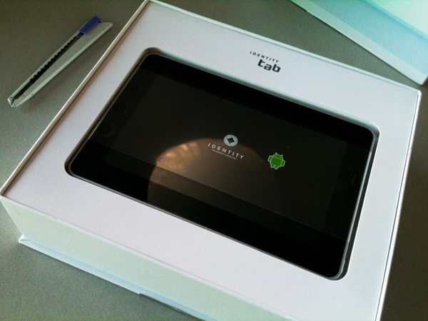
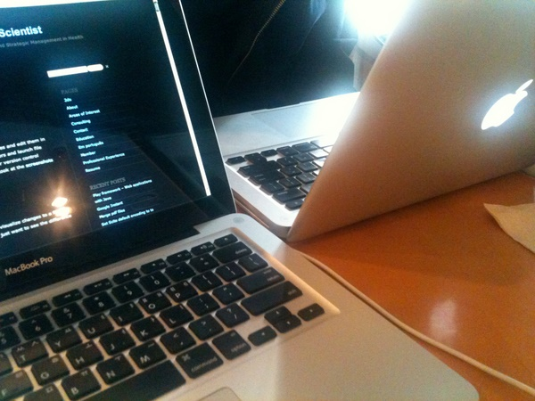
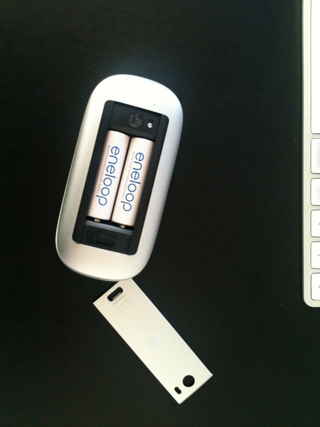
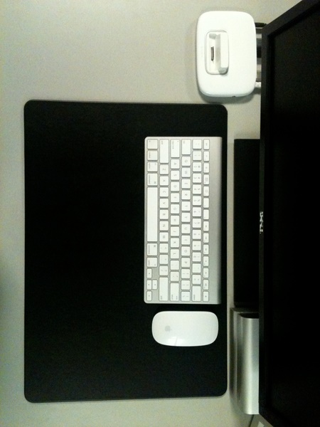
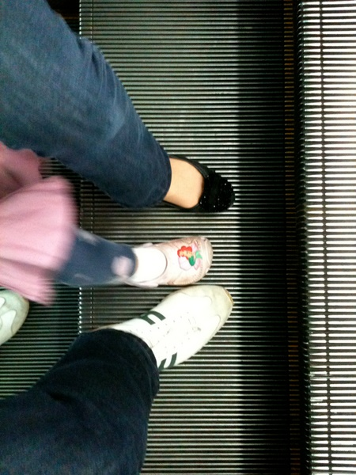
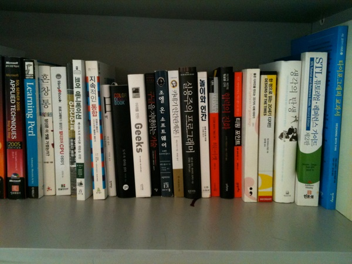

Title: 근황
Time: 14:10:00

일상 사진들은 트위터나 페이스북에 올리게 되는데, 어쩐지 그 비하인드 스토리들을 적지 않으니

글을 쓰는 방법을 점점 잊어가는 것 같다. 그래서 아쉬운 마음에 re-post.

  

아이덴티티탭. 제품 담당자는 어쩌자고 거센소리의 3연타를 제품 이름으로 선택한 것일까. 도저히 이해되지 않는다.

차라리 올레패드, 케이패드가 낫지 않았을까? 아니면 그냥 대놓고 그냥 아이탭!

해상도는 800x480, 액정의 느낌은 10년전 노트북, PDA와 같은 느낌. 멀티터치 안되는 액정에서 뭔가 글을 쓴다는 건 거의 불가능한
일로 여겨진다. 가나다라마바사를 '적당한' 속도로 입력하면 ㅏㅏㅏㅏㅏㅏㅏ만 찍힌다. 어휴.

  

  

  

미국에서 파일럿 훈련중인 친구 수재(@lono11, [http://lono.pe.kr](http://lono.pe.kr))가 한국에 잠시
들어온 김에, 강남역에서 된장남 흉내를 내보았다.

특별히 고성능을 요구하는 작업을 하지 않으니, 어댑터 하나로 번갈아 사용해도 충전에 여유가 있었다.

내가 잘 모르는 분야에 대해 많이 알고 있는 사람을 만나면, 엄청 반갑다.

많이 물어보고 싶었는데...

  
  

  

애플 매직마우스. 모서리가 너무 날카로워 오래 쓰고 있으면 손이 약간 아프다. 매직마우스와 기존 마이티마우스와의 그립감 차이는 마치
아이폰4와 기존 아이폰3Gs와의 차이와도 같다.

  

  
  

아무튼 매직마우스를 놓고 찍은 책상 샷.모니터가 델이라서 아쉽지만 뭐, 언젠가 돈 많이 벌면 애플 시네마도 사다놓을 수 있겠지.

데스크패드는 nhn스토어에서 판매하는 제품. ([http://nhnstore.naver.com/shop/detail.nhn?prod_id=N
_025](http://nhnstore.naver.com/shop/detail.nhn?prod_id=N_025))

( 마우스패드도 따로 주는데, 무선 키보드에는 오히려 따로 놓는게 불편. 최근에 회사에 합류한 후배에게 선물로 주었다. )

지금의 책상 상태는 예전 회사랑 비교하면... 한 200% 정도 마음에 든다. 앞으로도 파티션은 계속 설치하지 말아야지.

  

  

  

서하와 아내와 함께 서대문역 근처에 있는 캐나다 문화 어학원에 등록 후 첫 수업을 받고, 점심 먹으러 광화문 가는 길에 한 컷.

우리가 에스컬레이터를 타며 한 쪽 발을 얹으면, 서하도 꼭 따라서 얹는다. ^^

  

  

  

내가 좋아하는 책과, 최근에 산 책들을 회사에 가져다 두었다.

같이 일하는 사람들도 이런 책들을 같이 좋아하고, 읽었으면 좋겠다는 생각에 가져오긴 했지만, 그런 것을 강요하고 싶지는 않다. 다만, 필요한
순간에 적합한 책이 회사에 있고, 내가 그런 책을 추천할 수 있는 사람이 되어야지 싶다.

  

  

  

  

  

  

  
  

