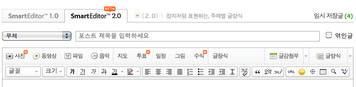

Title: 이것만은 고쳐줘, 스마트에디터 2.0
Time: 05:23:00

  

  * 1단 툴바에 N 같은거 넣지 말아줘. 강조하고 싶으면 굵게 하면 되잖아. N에 대한 내용을 찾아보려면 눌렀을 때 나오는 팝업에 안내도 없고, 어차피 다른 페이지 가야되잖아.
  * 글장식, 글양식 : 애초에 글 쓰라고 만든 에디터니까 그냥 장식, 양식으로 하면 두 글자로 맞추고 좋을텐데.
  * 사진도 파일도 다 첨부하는 건데, 글감은 왜 따로 글감"첨부"로 적은거야. 그냥 "글감" 이라고 하자. 그리고 글감은 양식보다는 나머지 첨부와 유사할텐데 왜 양식쪽에 붙어있니.
  * 글꼴, 크기 같은거 말고 제발 문맥을 넣을 수 있게 해줘. "제목", "본문" 이런거 아마추어 에디터 제작자들도 다 하잖아. 맨날 구호로만 시맨틱, 소셜 따위 하지 말고 에디터부터 고쳐줘 제발.
  * 글자색 지정 아이콘, 확실히 문제 있음. 예전엔 빨간색 '가'으로 했는데 검은색으로 맞추고 싶어서 그런거지? 그럴꺼면 어울리지 않은 스마일은 왜 노란색으로 넣었니.
  * 
태그 직접 쓰지 않게 문단 나눔 아이콘도 넣어줬으면. 글 쓰다보면 나도 "시맨틱"하게 문단 나누고 싶어.   연타로 채워넣기는 싫다구.
  * 그리고 몇 번이나 말하는 거지만, 편집기 가로 크기 내 스킨에서 표시될 실제 가로 크기에 맞춰줘. 제발.
  * 마지막으로, 위지윅하고 싶으면, 미리보기 필요 없을 정도로 CSS 좀 맞춰줬으면 좋겠네. 예측불허 에디터...

위의 불만사항은 매우 요약된 것. 아래 링크엔 더 길게 적었다.

[http://blog.naver.com/ez_/140113074795](http://blog.naver.com/ez_/14011307479
5)-내 맘에 안드는 네이버 블로그

  

  

스마트 에디터, 정말 여러 번 욕하게 된다. 2.0 되면서 기능 추가 하지말고, 크롬에서 자꾸 xml meta data 태그 추가로 찍히는
버그랑 위에 적어놓은 에디터의 '기본 중의 기본'에 해당되는 것부터 고쳐보자고. 쫌!

  

  

