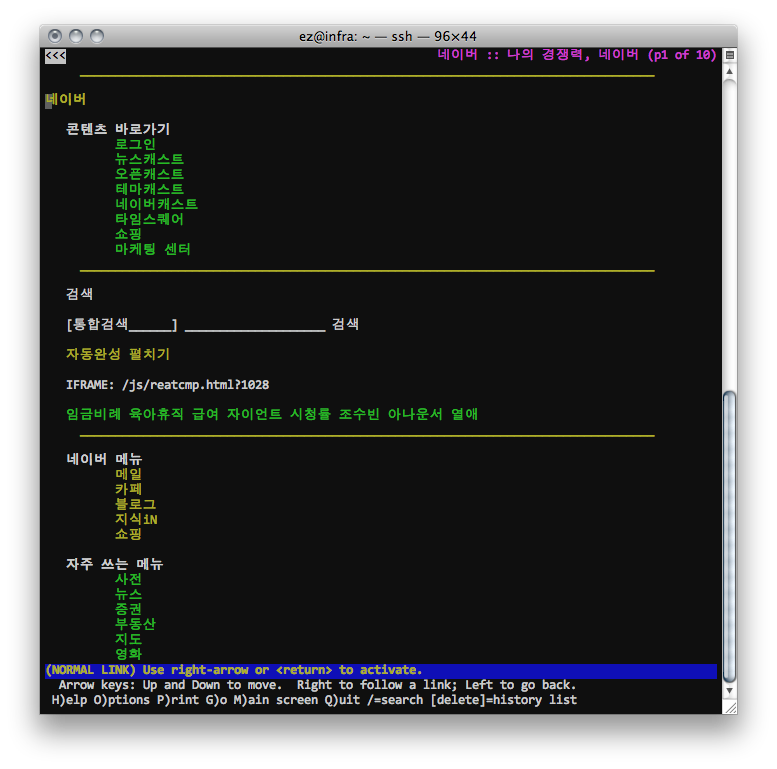
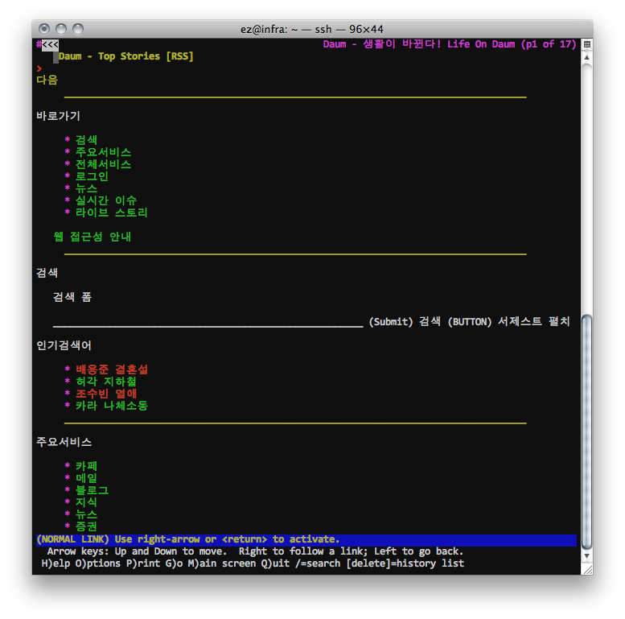
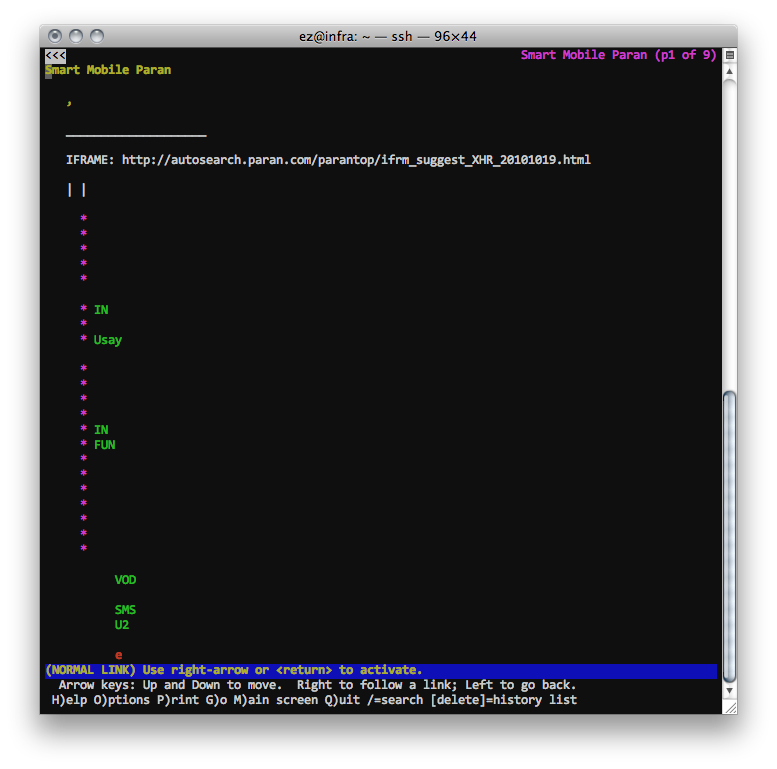
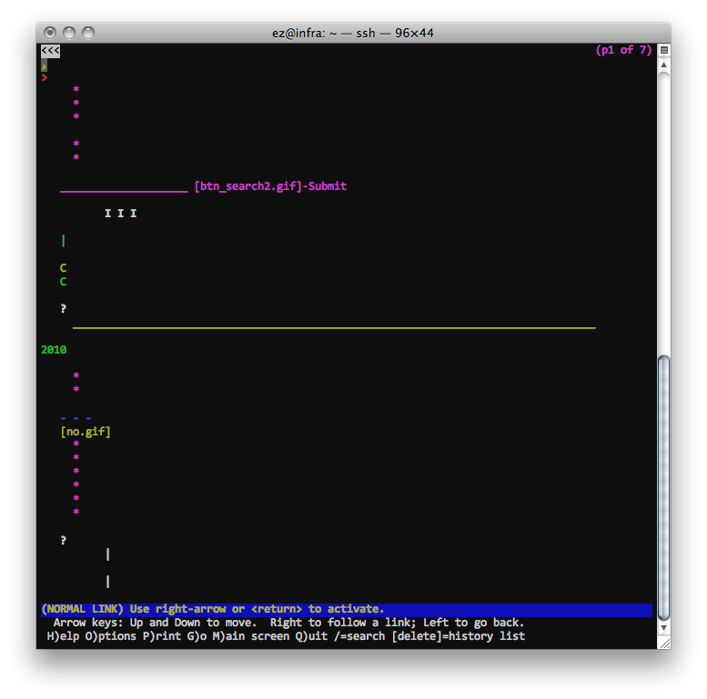
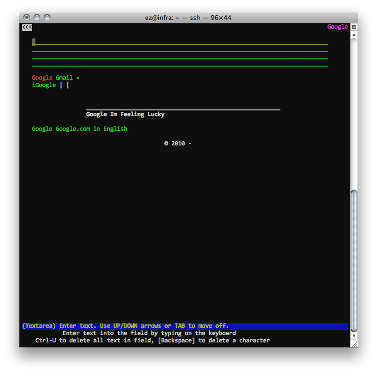
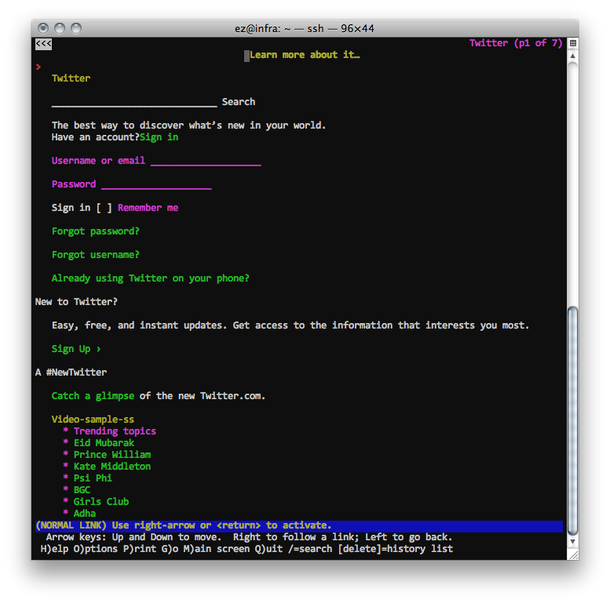
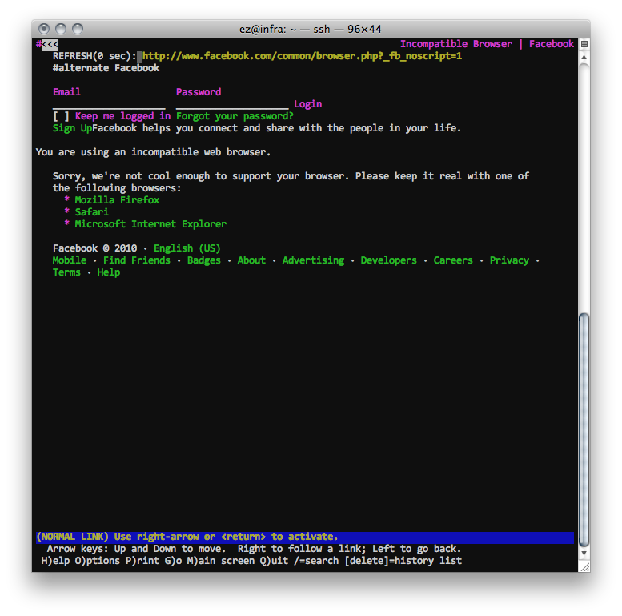
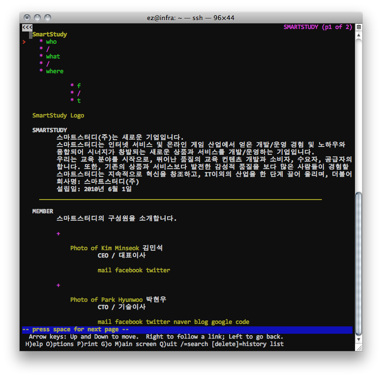

Title: 우연한 기회에 해본 여러 사이트들의 텍스트 브라우징
Time: 16:14:00

원격 작업을 하다, 방화벽 옵션 때문에 실제 페이지를 브라우저로 볼 수 없는 일이 있었다.

그래서 lynx를 로컬에 설치하고 결과를 확인했는데, 하는 김에 다른 국내 포털들과 유명 사이트도 같이 해봤다.

  

일단 네이버 : 매우 양호.

  

다음 : 네이버와 마찬가지. 매우 양호한 편.

파란 : 최근에 개편한 탓에 기대를 가지고 했지만, 대 실망. 아무 것도 알아볼 수 없다.

네이트 : 파란과 마찬가지. 0점

구글 코리아 : 상단 4개의 입력창은 왜 있는지 모르겠다. 워낙 내용이 없다보니 거의 동일.

트위터 : 로그인 하지 않은 상태. 양호하다.

페이스북 : 마찬가지로 로그인 하지 않은 페이지. 호환되지 않는 브라우저임을 알려주고, 다른 브라우저를 권장해준다. 양호.

스마트스터디 : 급조한 우리 회사 소개 사이트. 나쁘지 않다. ㅋㅋㅋ

  

텍스트 브라우저에서 모든 컨텐츠를 잘 보여주는 것이 웹사이트를 운영하는 기업의 의무 사항은 아닐지도 모른다.

  

다만, 어느 정도로 웹 표준을 준수하는지 알아볼 수 있고, 이는 대안 브라우저를 반드시 사용해야 하는 사람들을 어떻게 생각하는지에 대한
척도로 사용할 수 있겠다.

  

  
  

