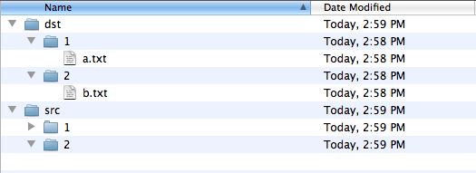
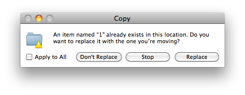
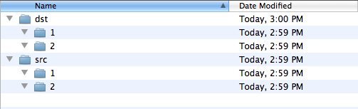
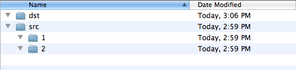

Title: Mac OS X : Finder의 무서운 덮어쓰기(?) 동작
Time: 15:11:00

Mac OS X에서 윈도우의 탐색기 같은 역할을 하는 파인더는 그 기능의 부실함에 항상 불편함을 느껴왔다.

그래도 그럭저럭 참고 썼는데, 같은 이름 덮어쓰기 문제는 정말 황당하다.

  

대부분의 맥 사용자들이 파인더의 이 문제에 대해 알고 있을지도 모르겠지만,

혹시 모르는 분들을 위해포스팅을 하지 않을 수 없다.

  

  

데모를 위해 폴더를 2개 준비 했다. (실험은 Mac OS X 10.6.6)

src 하위에 있는 1, 2 폴더는 비어있고, dst 하위에 있는 1, 2 폴더에는 각각 텍스트 파일이 하나씩 들어있다.

  

src 하위에 있는 1, 2 폴더를 복사해, dst에 붙여넣기 하면 다음과 같이 묻는 화면이 나온다

unixish의 cp나, 윈도우 탐색기의 복사에서는 이런 경우에 항상 'overwrite'할껀지, 'cancel'하는지 물어보게 되어 있다.

파인더는 'replace'하겠냐고 물어보는데, 이 팝업의 경고를 주의 깊게 읽지 않는다면 Replace하기 쉽상이다.

  

  

아래는 replace후 결과. 역시나 덮어쓴게 아니라 '교체'해버렸다.

  

사실 여기까지는 사용자가 주의 깊게 읽어보지 않은 실수로 볼 수도 있겠지만, 문제는 Command+Z를 통해 Undo한 이후.

  

보시다시피, 복구도 되지 않았고, 그냥 지워져 있다. (휴지통에도 없다)

어이구...

  

  

당연한 얘기지만, Mac OS X에서도 터미널에서 cp 명령어를 사용하여 복사하면 'overwrite'이 된다.

아무튼 조심해야 할 부분.

  

