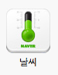

Title: 아쉬운 네이버 모바일 사이트 아이콘
Time: 05:36:00

많은 일들이 그렇겠지만,

디자인은 직접 안하는 사람 입장에서도 욕하기 쉬운 대상이다.늘 접하고 있어서 그럴지도?

  

사설이 길어지기 전에 본론으로 넘어가면, 최근에 있었던 네이버 모바일 사이트의 개편에 따라

같이 개편된 모바일 사이트의 아이콘들의 수준이 너무 낮아서, 짚고 넘어가지 않을 수 없어 이 글을 쓴다.

  

  

나는 전문적인 그래픽 디자이너도 아니고, 제대로 된 수업도 한 번 받은 적이 없는 탓에,

소비자의 입장에서 불만스러운 부분을 적는 정도에 그치겠지만.

  

  

이 아이콘들은, **개별적으로 따져봐도 세련되거나, 아름답지 못하고 조잡하며,**

**전체적으로 보더라도 조화롭지 못하고 통일성이 없는데다, 식별이 용이하지도 않다.**

  

  

  

일단 할 수 있는 욕은 다 했으니, 각각의 아이콘들이 내 맘에 왜 안들었는지 따져보자.

  

참고로, 아래 개별 이미지를 준비하는데 있어, ImageMagicK가 큰 도움을 주었다.

캡춰된 300x576 해상도의 이미지를 한 줄의 명령어로 잘라주었다. ( convert -crop 75x96 captured.png
m-%02d.png )

  

  

  

  

어찌보면 무난하지만 NAVER라는 글씨는 유치하게 왜 넣었는지 모르겠다.

그것마져 없었다면 너무 비어보여서 그랬을까.

이 때까지는 NAVER라는 글씨가 앞으로 무한히 반복되리라 예상하지 못했다.

  

제안: 이 아이콘 아무도 안 퍼갈테니까, 글씨 빼고 디자인 다시 해보자. 정 남기고 싶으면 여기에만 남겨놓고 다른거 다 빼기.

  

  

  

  

장례식장에 걸려있어야 할 것 같은 최악의 아이콘.

이번에도 역시 NAVER는 왜 넣었으며, 15일이 아닌데도 언제나 15일로 나온다.

차라리 네이버의 다른 캘린더 아이콘들처럼 월별 캘린더에 칸만 그려놓으라고.

  

제안: 요일 표시까지는 바라지 않을테니, 클래식한 디자인을 원한다면 토요일엔 파랑, 일요일엔 빨강 글씨로 오늘 날짜를 꼭 찍어줬으면.
1~31일(31개) x 빨강, 파랑, 검정 = 93개만 만들어두면 되잖아. 아, CSS로 이미지 잘라서 쓰느라고 그걸 포기 못했다고? 정
그렇다면 차라리 텍스트로 찍었음 좋겠네.

  

  

  

  

CC 추진하시는 분의 의지가 대단하다고 생각되는 부분. 네이버 메인 및 모바일 페이지의 CC 영역 인터페이스도 참 어이가 없었는데, (
사용자의 무한한 인내심을 요구 ) 아이콘도 유난히 튀는 검은색 배경을 가지고 있다. 무지개를 세 줄로 하면 WiFi 같을까봐 두 줄로
한거야? 그런거야?

  

제안: CC PV/UV 봐서 어지간하면 좀 포기하자. 네이버 미도 시작했는데, CC 까지 뭘 그렇게 안고 가는지. 아... 아이콘에 대한
제안을 해야지. 저 픽토그램(아이콘)은 이미 많이 소모된 이미지라, CC의 것으로 도저히 만들 수 없을 듯. 포기해. 그리고 배경으로 다른
아이콘과의 차별성을 표현하고 싶었으면, 나머지 아이콘들도 그렇게 하던지.

  

  

  

  

클래식한 NEWS가 되고 싶었던 아이콘. 폰트도 그렇고, 접혀있는 부분도 그렇고.

언제까지 신문의 이미지를 얹어 쓸 참인가? 신문사들을 너무 좋아해서 그런가.

이 아이콘 역시 메일 아이콘과 마찬가지로 네이버 글씨만 빼면 아무 것도 남는게 없게 된다.

  

제안: 젊어져 보는게 어떨까? 모바일에선 다음보다 너무 늙어보이잖아. 그리고 다른 메타포나 이미지를 좀 주워담았으면.

  

  

  

  

이 아이콘도 캘린더에 이은 창의력 제로, 상상력 제로의 산물. 언제부터 나뭇잎이 네이버 '카페'의 대표가 되었나?

커피 잔과 커피 접시의 투시도 안 맞는 데다가, 최악은 저 배경에까지 네이버 글씨를 음각으로 남겼다는 것. 도대체 왜? 누가 디자이너에게
이런 어처구니 없음을 강요한걸까? 아이콘 디자이너는 절대 저런 선택을 하지 않았을 텐데.

  

제안: 클래식하고 레트로한거 좋아하니, 차라리 2003년에 썼던 가방을 넣어보지 그랬어.

  

  

  

  

기존의 기울어진 말풍선 + 초록 blog 글씨만 봐도 네이버 블로그인 걸 알았는데, 이번 아이콘은 개악.

카페에 이은 어설픈 나무 배경 - 이런걸 한다고 해서 오거닉이나 자연 친화 기업이 되는건 아닌데 말이지.

말풍선 하단부 두께감 처리는 너무 너무 너무 어색하다. 저 어설픈 삼각형은 누가 넣은거야? 예전처럼 한 쪽으로 밀었으면 구겨넣은 음각
네이버가 좀 덜 불쌍해 보였을 듯. 이젠 손가락이 아파서 저 네이버 로고 욕도 못하겠다.

  

제안: 예전껄 쓰자.

  

  

  

  

'미투데이는 네이버의 서비스가 아닙니다' 왜냐?! 그렇게 고집하던 네이버 로고가 없으니까.

으하하하하하하하하하하하하하하하하하하하하하하하하하!

  

제안: 이젠 다른 조직들과 좀 친해져보길.

  

  

  

  

도대체 나무 배경이 있는 것과 없는 것들의 분류 기준을 모르겠다.

지식인이 언제부터 저런 이미지를 가지게 되었는지도 - 나에겐 여전히 아니며 - 잘 모르겠지만,

묻고 답하여 사용자가 만들어나가는 지식iN의 서비스에는 적합하지 않은 이미지라고 생각된다.

오히려 예전에 좀 유행하던 엑스퍼트류 같지않나? 대졸자만이 답해주는 서비스. 이런 것도 아니고. 왜 저걸 택했을까.

  

제안: 서비스의 핵심 가치를 파악해보자. '지식과 내가 함께 커나가는 곳'이 현재 슬로건인데, 이거랑 어울리나?

  

  

  

  

네이버 증권에서는, 하락해도 빨강, 상승해도 빨강입니다. 언제나 즐겁습니다.

  

제안: 이래가지곤 K증권 홍보 밖에는 안될 것 같으니, 네이버 증권이 가지고 있는 다른 장점들을 녹여보는게 좋을 듯.

  

  

  

  

다음 모바일 페이지는, 스와이프도 지원해서 보기 좋던데, 네이버 날씨는 메인 페이지를 드래그 한~참해서 내린 후에,

이 아이콘 클릭하고 봐야한다. 이게 뭐니... 게다가 이 아이콘 보고 소주병같다고 하는 사람만 벌써<s> 두 명째.</s> 글 쓴 후
연락받아 추가. 세 명째.

  

제안: 사용자들이 원하는건, 오늘의 날씨. 색과 숫자 좀 넣어주면 안될까. 그것도 CSS 이미지 슬라이싱 때문에 안된다고 하면, CSS
때문에 서비스도 접겠네?

  

  

  

  

네이버 뉴스에 이어, 완벽한 레트로의 완성! 브라운관 TV가 여기 있습니다!

미투데이는 아예 보라색 작렬하는데, 굳이 검은색 배경에 묻혀버릴 초록색으로 TV쓴 건 무리수 아닌가?

  

제안: 아이리버도 로터리는 복원하지 않았다며.

  

  

  

  

만화책 저렇게 접어서 보는 사람 한 번도 못 봤다. 디자이너의 무리수.

다른 책 이미지를 채용한 아이콘들은 저렇게 안했는데, 왜 이것만 이렇게 한걸까.

펩시맨처럼 생긴 애매모호한 그림도 어색하지만, 최악은 역시나 NAVER를 넣은 것. 이제 진짜 손아파서 로고 욕 그만 해야겠다.

  

제안: 웹툰 대표 캐릭터들 좀 밀어주면 어떨까? 요일별로.

  

  

  

  

TV 스케쥴에는 TV라고 꼭 써줘야 했고, 영화는 MOVIE라고 써주기 싫었던 모양.

  

제안: 모바일 예매를 밀고 싶었으면 넣어볼 수 있는 이미지가 많았을 텐데.

  

  

  

  

으하하하하하하하하하하하하하하하하하하하하하하하하하!

한글날 기념하여 무료 폰트도 배포한 회사가 만든 아이콘이 바로 'BOOK'이 박혀있는 이것이다.

어색하게 그지 없는 BOOK 폰트하며, 보일듯 말듯 보이지 않는 초록 책갈피까지.

  

제안: 상상력을 좀 발휘해줘. 웹툰에는 펩시맨도 넣었으면서 책 아이콘은 정말 이게 최선이니.

  

  

  

  

책에 이은 끝판왕 등장.

  

잘 보면, 책 아이콘과 두께감도 다르고, 접합부 잡아주는 부분의 디자인도 다르다. ( 전문용어를 잘 모르겠다 )

하지만 네이버 로고를 꿋꿋이 박고 있는 것과, 상상력이 부재되었다는 것은 동일. 아... 네이버 로고 욕 그만하기로 했는데 그만할 수가
없네!

  

그리고, 저 아이 초상권은 확보했겠지?

마지막으로, 사진 잡고 있는 부분까지 꼭 검은색으로 해서 어색함을 더할 이유는 뭐였을까.

  

제안: 네이버의 포토앨범 서비스는, 사진을 '종이앨범' 형태로 만들어주는 서비스가 아닙니다. 생각 좀 해보세요.

  

  

  

  

책 형태의 디자인은 매번 달라진다. 이번에도 또 다름.

옆에 ㄱㄴㄷㄹㅁㅂ의 디테일(?)을 포함하여 흉상의 실루엣까지, 애플의 연락처 아이콘의 패러디에서 벗어나기엔 어려워 보인다. 뭐 굳이, 벗어날
이유도 없다고 본다. '책' 이나 '포토앨범'에서 받은 충격이 커서, 차라리 무난해 보인다.

  

제안: 책 형태의 아이콘들 기본 템플릿 통일 좀 하자.

  

  

  

  

사람의 흉상대신에, 돼지를 넣다보니, 좀 비좁았던 모양이다. 주소록에 비해, 잡아주는 부분의 영역이 줄어들었다.

그리고, 네이버 가계부 서비스를 쓰는 사용자 계층이 이 클리셰를 계속 유지해야 하는 계층일까?

진부한 걸 좀 벗어나서, 세련된 느낌을 줬으면 좋겠는데 모든 아이콘이 이 모양이다.

  

제안: 이왕 돼지로 할 꺼면 핑크로 하자. 농담.

  

  

  

  

포토앨범 아이콘 디자인했던 친구와 책 아이콘 디자인 했던 친구가 만나서 같이 만들었나보다.

기본 템플릿은 포토앨범 아이콘과 같은데, 책갈피는 책 아이콘에서 따온 것 같다. ( 같지는 않다. )

  

제안: 이젠 귀찮다...

  

  

  

  

  

  

아래는 그나마 나은 녀석들.

  

N을 다른 타입과, 파란색으로 써서 최악에서 탈출. +10점

제안: LED가 잘 안보이는데, 좀 파서 강조해주고, 나사를 보다 키우고 강조한다면 데이터가 보호되는 클라우드 서비스임을 인지시킬 수 있을
듯.

  

  

  

이름 참 잘 바꿨다. 로고도 OK.

제안: wingspoon 글씨 넘 작아서 뭉게져 보인다. 실제로 레티나 아닌 핸드폰들에서 어떻게 보이는지 확인하고, antialias를
조정해주면 좋을 듯.

  

  

  

  

주변 사람들에게 이 아이콘들에 대해 욕을 열 번도 넘게 한 것 같다.

왜 이렇게 밖에 못한 걸까 생각해보면, 아래와 같은 시나리오가 나오는데, 아마 맞을 듯.

  

---- 모바일 네이버 사이트 개편을 위한 디자인 리뉴얼 회의 결과 ----

참석자 : 실장급 5명, 팀장급 20명

요약 : 120분에 걸쳐 시안 10가지가 모두 아웃.

방안 : 아이콘 크기만 통일하고, 각 사업부에서 알아서 만들어 오기.

  

  

