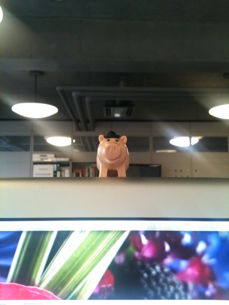
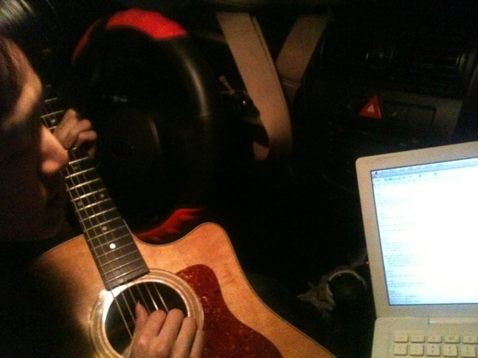
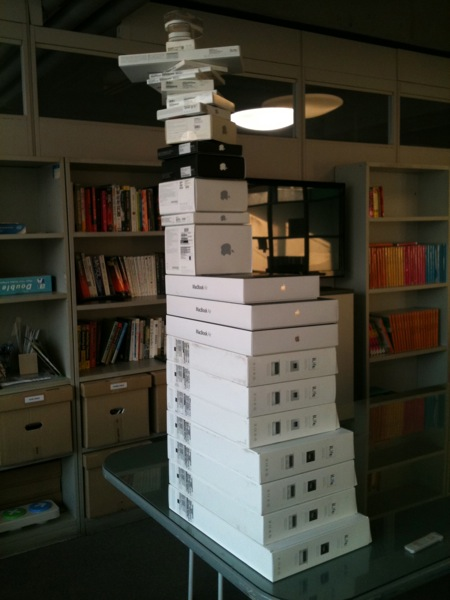
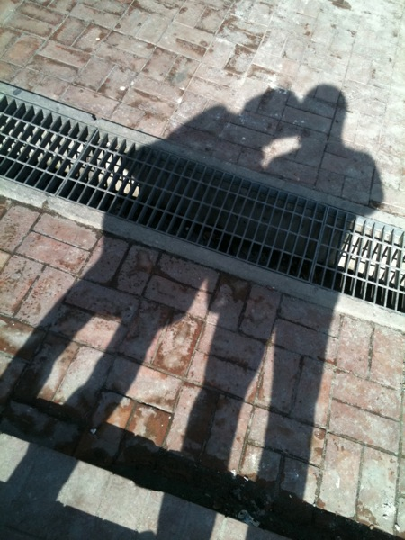
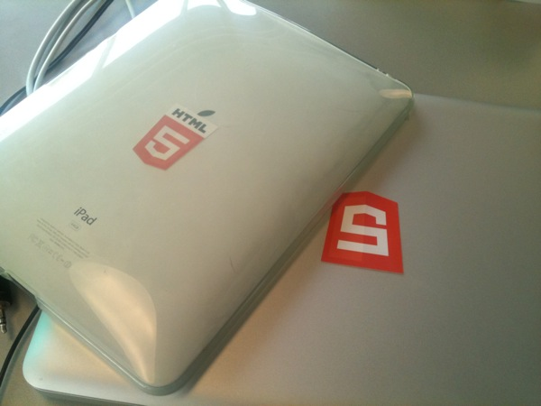
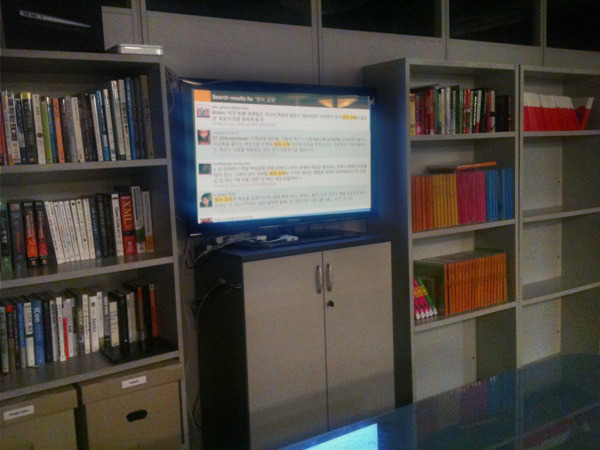
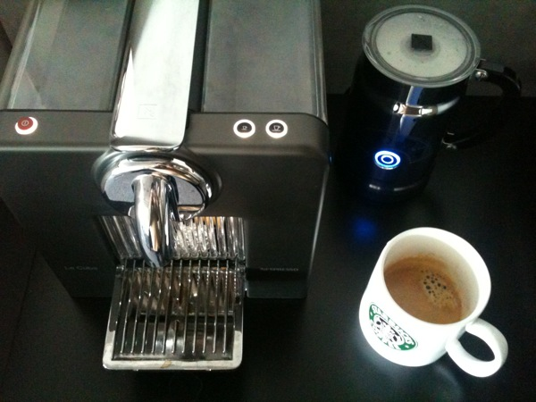

Title: 일상
Time: 01:33:00

간만에 일상 정리.

  

사무실에 굴러다니던 토이스토리 레고들 중, 동물들을 골라 모니터 위에 붙여놓았다.

이 녀석은 나랑 딱 어울리는 것 같다. ㅋㅋ

  

  

  

야근하는 날 픽업해준 상욱이.

집 앞에서 맥북 펴놓고 차 안에서 기타치면서 작업물을 공유했다. 어떤 방향으로든 잘 되리라 믿는다.

이런 시간이 더 많으면 좋을텐데. 3월이 지나면 좀 여유가 생기려나?

  

  

사무실에서 그간 사들인 애플 제품으로 탑을 쌓아보았다.

회사 옮기고 나서 애플 제품에 대한 '사재기' 욕구는 많이 풀어본 것 같다.

맥북 에어 11"부터 맥북 프로 17"까지 거의 모든 라인업이 모두 있다. ㅎㅎ

  

  

  

아내와 오랜만에 함께 찍은 그림자 사진.

예전엔 이런 사진 종종 찍었던 것 같은데, 요새는 질투쟁이 서하가 달라붙어 있으니, 이런 사진도 흔치 않다.

  

  

  

  

바쁜 틈을 타, HTML5 로고를 인쇄해 맥북과 아이패드에 붙여주었다.

로고를 배치하여 인쇄물을 준비하고, 인쇄를 시키면서 잉크 냄새를 맡고, 시간을 들여 칼질해 내는 일련의 과정이 너무 좋다.

  

  

  

역시나 바쁜 틈을 타(바쁠 때 우린 언제나 서랍 정리를 했지 -_-) 자바스크립트 베이스로 트위터 검색 페이지를 만들어보았다.

트위터 검색 결과를 전체 화면으로 보여주고, 일정 주기마다 자동으로 갱신되는 그런 앱이나 웹을 찾았으나, 마땅한게 없어 트위터 검색 RSS
결과를 자바스크립트에서 파싱해서 10초마다 갱신되도록 작업하였다. 지금은 서버 PHP의 도움을 받고 있는데, 조금만 개선하면 완전 클라이언트
베이스로 이전 가능할 듯. 공개 예정.

( 외부인이 회의하러 오거나 하면 '허세'용으로 종을 것 같다. ㅎㅎ )

  

  

  

요즈음의 회사 생활을 풍족하게 해주는 일등 공신인 네스프레소!

동료가 집에서 쓰던걸 가져와준 덕분에 즐겨 마시고 있다. 에어로치노까지 풀세트.

진하게 먹는 사람 기준에서는 좀 연하게 느껴지겠지만, 나처럼 자주 마시는 사람에게는 흐린게 오히려 낫네.

  

  

  

이렇게 2011년 2월이 흘러가버리네. 벌써 3월.

3월부터는 서하도 유치원에 다니게 되었다. 우리 가족의 삶에 많은 변화가 있을 듯.

모두 건강했으면 한다.

  

  

