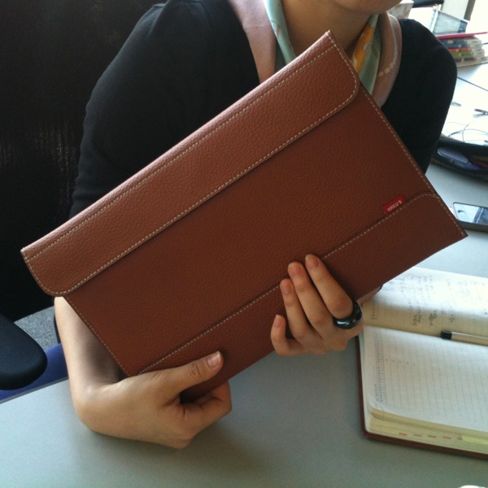
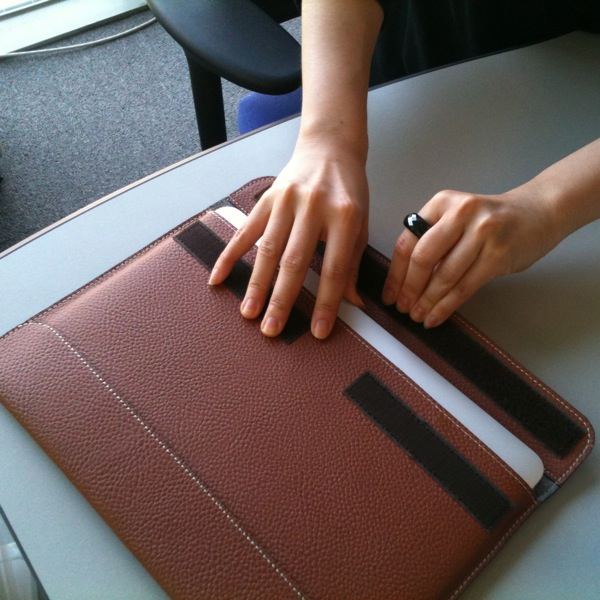
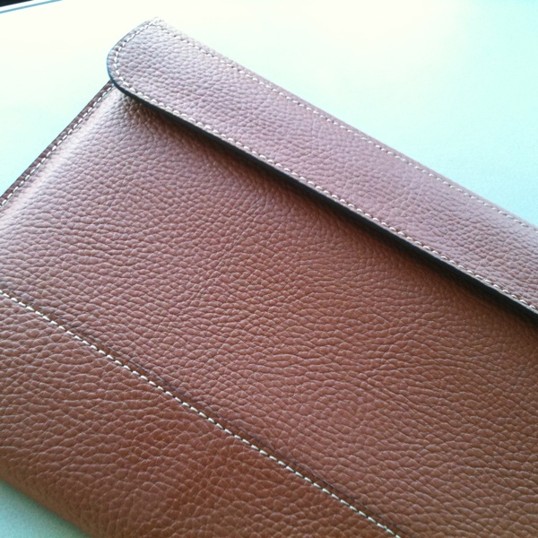
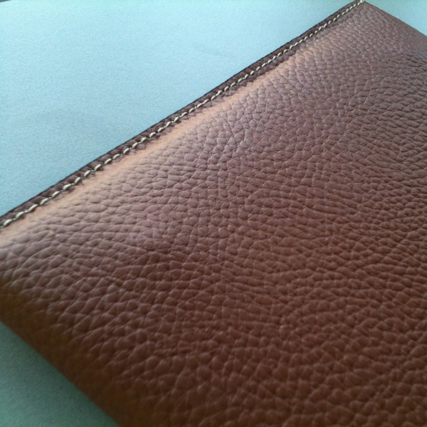
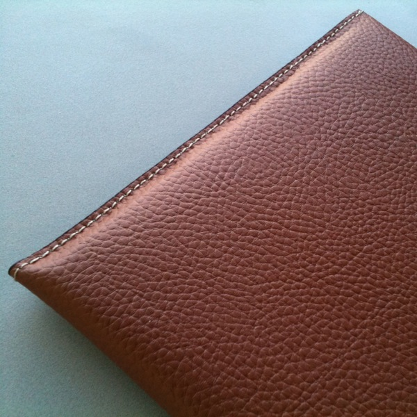

Title: HAKUS 맥북에어 11인치 파우치 수령기(?)
Time: 18:56:00

하쿠님 블로그에서의 이벤트를 통해, 획득한 HAKUS 맥북에어 11인치 파우치에 대한 수령기(?)를 적어봅니다.

아이패드 파우치에도 관심이 있었는데, 이번에 이벤트를 진행하셔서 11인치 파우치를 먼저 경험해보게 되었네요.

  

아이폰으로 찍은 사진이라, 색상이나 느낌이 실제와는 좀 다릅니다.

  

  

카멜 색상을 신청해서 받았습니다. 좀 더 연한 노란빛을 띄고 있으면 갈색과 차별화되어 예쁘지 않았을까 하는 생각이 들지만, 지금도 스티치와
색상이 어울리는 편이라 무난합니다. 빨간 태그가 예쁜 포인트를 잡고 있습니다. 다만, 가죽 표면이 사진상으로 봤을 때 느꼈던 매끄러운 질감이
아닌 것이 아쉽습니다.

  

  
  

하쿠님이 작성하셨던 포스트에도 남겼었지만, 벨크로가 너무 커서 여닫기가 힘든 것이 단점입니다. 벨크로 열기 전에는 우아하게 들고 다니다가,
막상 열려고할 때 나는 소리가 제품의 성격과는 어울리지 않는게 아닐까 싶습니다. 좀 더 작은 크기로 라운딩 처리되어 작업된다면 좋을 것
같습니다. 지금은 '너무' 안전해서 아쉽네요.

  

  

  

  

받자마자 바로 맥북 에어를 넣어보았는데, 가죽 제품의 특성상 유격 없이 빡빡한 편입니다.

제품을 넣고 덮개를 덮으면 약간 뜨는 단점이 있는데, 사용하다보면 자리를 잡지 않을까 싶습니다.

  

  

  

덮개를 열어 사과마크가 위로 보이게 맥북에어를 넣으면, 뒤의 평평한 부분에 맥북에어의 발이 조금 튀어나와 보입니다. 오랫동안 이렇게
쓰다보면, 가죽이 연한편이라 4개의 발 부분이 아예 튀어나오지 않을까 걱정되네요.

  

  
  

사과마크를 아래로 가게 넣으면, 깔끔해집니다. 아무래도 이 방향으로 주로 넣어야할 것 같습니다. ^^

  

  

  

  

장점 : 저렴한 가격(38,500원)에 비해 비교적 양질의 가죽 재질과 스티치 처리.

단점 : 다소 끈적이는 듯한 표면 질감. 지나치게 안전한(?) 덮개부분 벨크로.

  

  

벨크로 여닫는 부분만 개선이 된다면, 더 좋은 제품이 될 것 같습니다.

감사히 잘 쓰도록 하겠습니다! 이제 파우치 없다고 1kg에 불과한 맥북에어를 놓고 다니던 동료분을 타박할 수 있겠네요.

  

  

