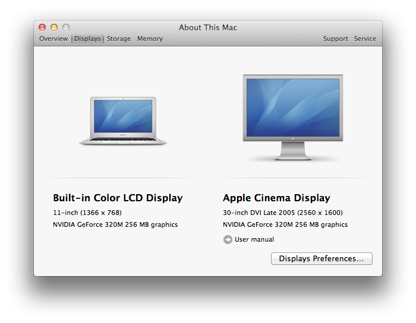

Title: software list on my mac
Time: 10:10:00

회사에서 사용하는 노 트북을 1년만에 바꿔봤다.

MacBook Pro 13" Mid 2010 에서 MacBook Air 11" Late 2010 로 노트북을 바꿈.

Processor : Intel C2D 2.4 Ghz -> Intel C2D 1.4 Ghz

Memory : 6GB -> 2GB

Storage : 250GB HDD -> 128GB SSD

Display : 1280x800 -> 1366x768

  

원래 쓰던 것도 그리 빠른 모델이 아닌 관계로, 퍼포먼스는 별 문제는 아닌데, 가장 부족한 건 키감일듯.

친구 민석이 표현대로 바닥을 두드리는 느낌이 난다. 피치는 같아도 스트로크 감과 깊이가 이전 모델에 비해 부족.

  

  

메일은 전부 IMAP이라 백업 필요 없음.

데이터는 대부분 회사 서버 AFP 공유 / SVN으로 관리하던 덕에, 영상 촬영 및 외주 데이터 등 10GB 정도만 집 NAS에 간단히
백업.

  

새로하는 김에, 설치하는 소프트웨어 목록을 정리해본다.

(정리중)

  1. Mac App Store
    1. XCode
    2. Moom :[http://itunes.apple.com/us/app/moom/id419330170?mt=12](http://itunes.apple.com/us/app/moom/id419330170?mt=12)
  2. Homebrew :[http://mxcl.github.com/homebrew/](http://mxcl.github.com/homebrew/)
    1. mysql
    2. cmake
    3. ImageMagicK
    4. ffmpeg
  3. easy_install / pip
    1. virtualenv
    2. django
    3. PIL
    4. MySQL-python
  4. via Legacy installer
    1. Google Chrome
    2. Google Picasa
    3. Adobe Flash browser plug-in
    4. iWork
    5. Adium :[http://adium.im/](http://adium.im/)
    6. Filezilla :[http://filezilla-project.org/](http://filezilla-project.org/)
    7. Microsoft Intellipoint for Mac :[http://www.microsoft.com/hardware/en-us/downloads](http://www.microsoft.com/hardware/en-us/downloads)
    8. DropBox
    9. ucloud
    10. NetNewsWire

  

