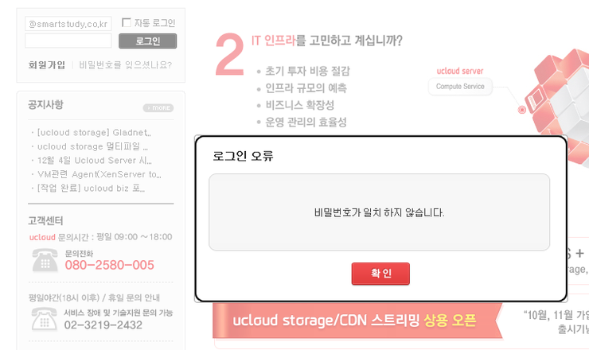
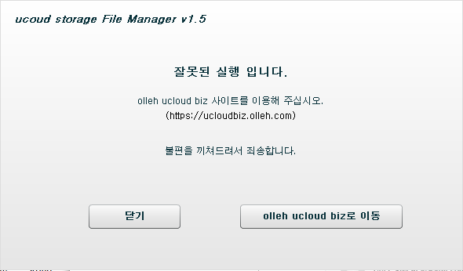
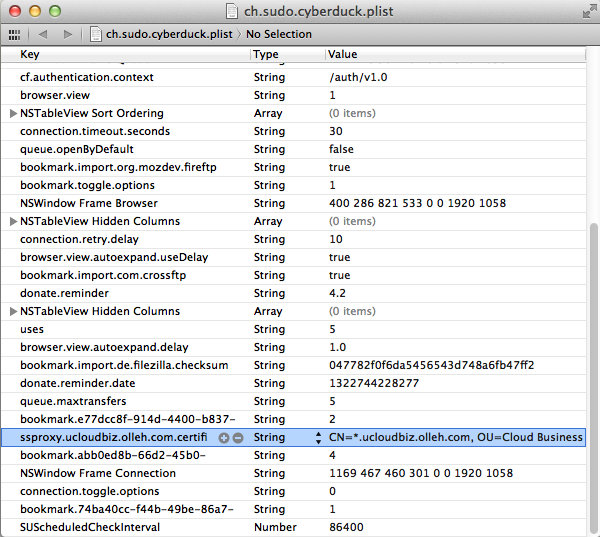
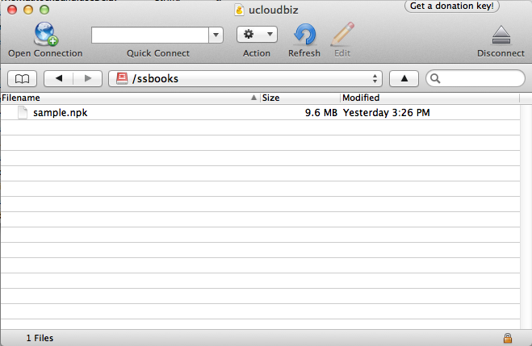

Title: KT ucloudbiz에게 실망
Time: 15:51:00

회사에서 미국, 일본 서비스를 런칭하며 서비스 품질 향상을 위해 VPS / CDN 서비스가 필요한 때가 되었다.

결론부터 얘기하면, KT ucloudbiz에게는 실망, Amazon AWS는 만족이다.

AWS에 대한 얘기는 검색하면 사용기가 많이 있으니 생략하고, ucloudbiz에 대한 실망을 적어보고자 한다.

  

  

**총평 : KT ucloudbiz 서비스는 오직 "Microsoft Windows"만을 위해 만들어졌습니다. 나머진 쓰지마...**

  

  

  

**(1) Microsoft Windows + Internet Explorer 에서만 사용할 수 있는 서비스**

홈페이지인 https://ucloudbiz.olleh.com/ 에는 버젓이 [본 사이트는 파이어폭스에 최적화 되었습니다.] 라고 적혀있지만,

  

하지만, MS Windows + IE 조합이 아니라면 로그인조차 할 수 없다.

  

Mac OS X를 주로 사용하는데, Chrome, Firefox, Safari 모두 비밀번호가 일치하지 않는다고 나오며, 심지어

MS Windows의 Chrome, Firefox에서 마찬가지 이유로 로그인이 불가능하다. 오직 IE에서만 로그인을 성공했다.

  

애초에 파이어폭스 최적화 따위 말을 적지 말던가...

  

  

  

  

**(2) Microsoft Windows에서만 파일을 올리세요.**

ucloud storage서비스는 파일을 올릴 수 있는 두 가지 방법을 지원하는데, (a) 웹 사이트에 접속하여 Adobe AIR로 작성된
업로드 소프트웨어를 사용하거나, (b) OpenStack 프로토콜을 지원하므로,해당 프로토콜을 지원하는 클라이언트를 사용하도록 안내하고
있다.

  

(a)의 방법에서 사용하는 프로그램은 웹 사이트에 접속하면 자동으로 설치가 진행되는데, 설치가 끝난 이후에는 시작 표시줄 프로그램 목록에
"ucloud storage File Manager"로 등록이 된다. 그렇다면 상식적으로 이 프로그램을 바로 실행해서 로그인, 업로드가
가능할 것처럼 느끼지 않을까? 헌데, 이 프로그램은 웹을 통해서 실행해야만 사용할 수 있다. 아니, 그럼 애초에 프로그램 목록에 넣질
말던가...... 그리고 이 프로그램은 폴더를 올릴 수가 없다. 오직 파일만 여러 개를 선택해서 올릴 수 있는데, 뭐 어쩌라는건지.

  

(b)의 경우는 더 가관이다. 자료실에 있는 모든 문서를 살펴보면 CloudFuse나 Cyberduck을 이용해서 업로드 할 수 있다고
얘기는 하지만, 모든 설명은 MS Windows 기반이다. 심지어 Cyberduck을 설치한 이후에 자신들이 제공하는 패치를 적용하라고 되어
있는데 해당 파일의 이름이 patch.exe다. 그러니까, Windows에서만 쓰라는 얘기다. OS X용 Cyberduck도
OpenStack을 지원하지만 서버와 사용자 정보를 아무리 정확하게 넣어도 로그인을 할 수 없다.

  

답답한 마음에, 도대체 patch.exe가 어떤 역할을 하는지 살펴보니 Cyberduck이 사용하는 user.config 파일을 수정하는
것이 전부다. 아래의 2줄을 추가하는 것으로 보인다.

  

  * <setting name="ssproxy.ucloudbiz.olleh.com.certificate.accept"value="CN=*.ucloudbiz.olleh.com, OU=Cloud Business Department, O=KT, L=Seongnam-si, S=Gyeonggi-do, C=KR" />
  * <setting name="cf.authentication.context" value="/auth/v1.0" />

  

그래서, OS X에서도 같은 역할을 하는 ~/Library/Preferences/sh.sudo.cyberduck.plist 파일을 XCode
편집기로 열고 위 두 내용을 Key : Value로 구분하여 아래와 같이 넣었다.

  

  

그랬더니.......... 된다.

  

  

  

이 서비스의 PM은 도대체 무슨 생각을 하는지 모르겠다. 일정 규모 -ucloud biz 사용을 고민할 정도인 -이상의 회사라면 해당 역할은
시스템 엔지니어 등이 담당할 가능성이 높고, (몇몇 사람들은 Windows도 쓰겠지만) 리눅스나 기타 OS, 그리고 GUI가 아닌 환경에서
일할 확률이 높다. 그렇다면 스크린샷 대충 캡춰해서 무성의하게 만들어진 Windows용 Cyberduck 가이드 문서를 만드는 대신,
간략하게 텍스트로 작성된 cloudfuse install 및 사용법, 실행시 커맨드라인 옵션등을 제공하는 것이 당연한거 아닌가?

  

결국, 일본 서비스도 ucloudbiz 대신 Amazon EC2 + EBS + CloudFront 등으로 설정하게 되었다. 가격적인 측면이나
한국어로 지원을 받을 수 있는 잇점 등을 고려해 ucloudbiz를 사용하고자 했지만, 배려가 없어도 너무 없다.

  

  

서비스의 담당자가 이 글을 본다면 다른 환경에서 개발 및 서비스를 진행하는 이들을 위해 보다 많은 노력을 기해주길 바란다.

  

  

이 글에 대한 후기 :[http://blog.naver.com/ez_/140146636414](http://blog.naver.com/ez_
/140146636414)

