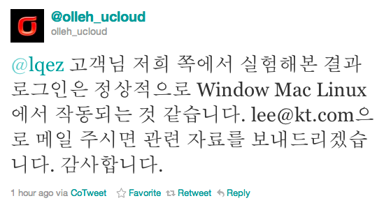
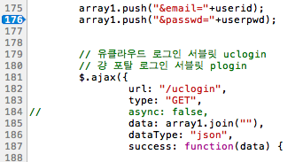

Title: olleh ucloud biz 사이트 로그인 문제
Time: 17:00:00

내가 KT 직원도 아닌데 이런 글까지 쓰는 이유는, 아래와 같은 공식 계정에서의 트위터 멘션을 받았기 때문이다.

  

[http://twitter.com/#!/olleh_ucloud/status/144304209964175360](http://twitter.
com/#!/olleh_ucloud/status/144304209964175360)

  

**정리.**

상황 : 로그인을 ajax로 요청할 때, GET으로 사용자명(이메일)과 패스워드를 직접 보내고 있다.

문제점 : URL에서 별도 처리되는 기호(#, &등)가 비밀번호에 포함되어 있으면, 올바르게 서버로 전달되지 않는다.

해결 방법 : GET으로 값을 보내기 전에 각 값을 이스케이핑하거나, POST 요청으로 변경한다.

참고 : [RFC 1738,Uniform Resource Locators
(URL)](http://www.ietf.org/rfc/rfc1738.txt)

  

  

**현재 상태.**

로그인을 요청하는 부분을 보면, 사용자의 입력 값을 이스케이핑하지 않고 바로 array에 넣은 다음, 해당 array를 join해서 요청하고
있는 상태.

  

portal.login.js, 175~188L

  

  

회원 가입 페이지([링크](https://ucloudbiz.olleh.com/portal/portal.joinpage.html))에서
비밀번호에 대한 안내는 '영문 또는 숫자를 혼용하여 6~12자리까지 입력가능합니다.'라고 하고 있다.

하지만 나는 특수 문자를 포함해서 비밀번호를 입력할 수 있었다. 안내만 써놓지 말고 특수 문자를 안 받도록 클라이언트/서버 단에서 전처리하는
것이 당연한 것으로 생각된다.

  

**이렇게까지 알려줬으니 이젠 좀 고쳐줬으면 좋겠다.**

일단 비밀번호를 이스케이핑 필요 없는 것들로만 바꿔보니. 역시나 잘 됨.

